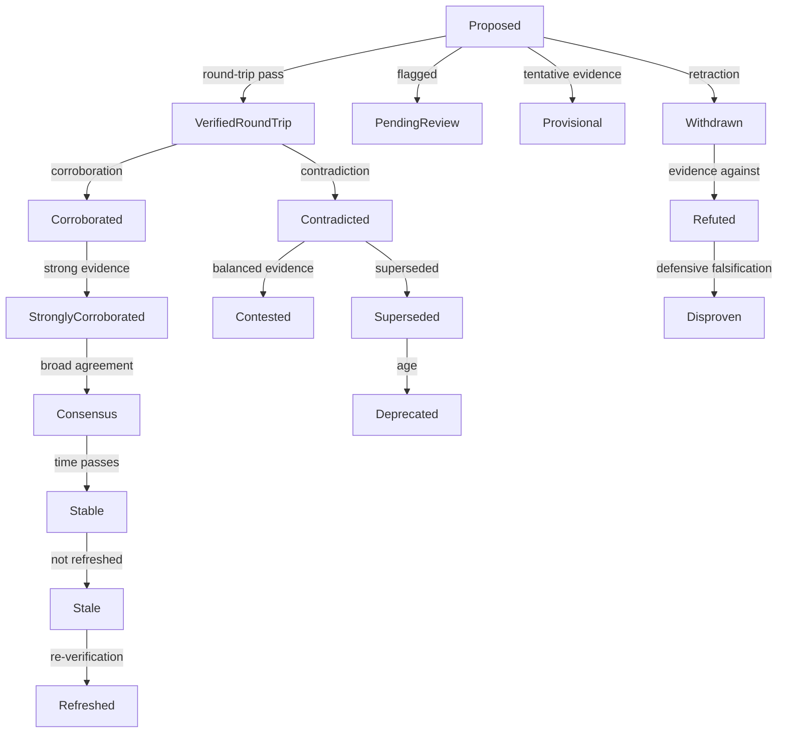

# nCPU / NPCoT Execution Roadmap

Status date: 2026-06-11. This is the committed execution plan. Each rung has
an owner track, a definition of done, and a verification requirement. Nothing
ships without its verification step passing.

## Context

NPCoT = discover a program that provably produces the right answer, verify
it, cache it in a similarity-keyed library, reuse it forever. The browser
runtime (kernels/npcot_wasm, 113 KB WASM) now synthesizes v2 programs
(multi-field records, mined predicate guards) and exports discovered programs
in 5 languages. The heavy synthesizer (nsynth) carries three cross-run memory
banks: solved programs, learned gradient biases, rejected programs
(negative memory). The LLM tier (autoresearch) lifted Qwen3.5-4B from 58.5%
to 85.98% HumanEval for $0.39 GPU via verified compounding.

The cascade: browser tier (instant, exhaustive, refuses honestly) → nsynth
(loops/branches/strings/algorithms) → LLM (anything) → verified wins distill
back down into the cheap tiers.

## Rung 1 — Synthesized-Pong demo (proof of wow)

A playable game on ncpu.ai where every rule of game logic was synthesized
from I/O examples and verified — physics step, paddle bounce, scoring,
bounds checks. The human-written part is only the dumb canvas/event loop.

- Game-logic programs come from problems the nsynth benchmark already
  solves: simulate_gravity, combat_resolve, score_tracker, grid_bounds_check,
  turn_order_rotate (105/105 coverage artifact).
- Transpile Mog → TypeScript via nsynth/src/mog_transpile.rs (to_typescript).
- New page: sms-hub/apps/ncpu-site/src/app/pong/page.tsx. Banner: "No human
  wrote this game's logic — it was discovered from examples and verified."
- Each rule displayed alongside the game with its source + the examples it
  was synthesized from.

DoD: `pnpm build` green; Playwright drives a paddle, ball bounces, score
increments; page shows per-rule synthesized source. Screenshot artifact.

STATUS: ✅ shipped (sms-hub `7c46bc9`). 22 rules: 14 synthesized + 8
composed from synthesized primitives, all domain-swept. Full provenance,
the exact training inputs, and the reproduction harness live in
`tools/pong_synthesis/` (committed artifact `pong_rules_final.json`;
`finalize_pong_rules.mjs` regenerates the site's synthesized.ts
byte-identically and fails loudly on any sweep mismatch).

## Rung 2 — Stateful skills (format v3)

Today's programs are stateless folds. v3 adds a persistent state vector:
skill = (state, input) → (state', output). Unlocks counters, debouncers,
running statistics, state machines — i.e. interactive programs.

- Extend kernels/npcot_wasm: ProgramV3 owns `n_state` floats; per-step
  execution reads/writes state. v2 remains the exact special case n_state=0.
- Serialization: `"format": 3` + `program_v3` key; v1/v2 loaders reject
  cleanly (same versioning discipline as v2: old runtimes must fail closed,
  never mis-execute).
- Synthesis: enumerate state-update/output pairs over the existing op
  vocabulary; thresholds and constants mined from examples (no hardcoded
  vocabulary — emergent only).
- Trace examples: a v3 training example is a sequence of (input, expected
  output) steps; verification replays the trace.

DoD: cargo tests cover discovery of a running-counter, a running-max with
reset signal, and an honest refusal on a non-expressible trace; v2/v3
equivalence test at n_state=0; WASM exports synthesize_v3/insert/consult;
all existing 24 tests stay green.

## Rung 3 — Synthesis API endpoint (the cascade, served)

nsynth behind HTTP so browser refusals escalate to the heavy synthesizer.

- New module: ncpu/synthesis_api/server.py — stdlib-only HTTP server in the
  style of ncpu/self_optimizing/npcot_server.py (zero deps, <100 MB).
- POST /synthesize {name, signature?, examples: [{inputs, expected}]} →
  shells out to nsynth/target/release/mog_synth --problem-json - (already
  supported), returns {success, method, code, transpiled: {python, rust,
  typescript}} using mog_transpile via the CLI or a --transpile flag.
- GET /health, GET /stats (bank sizes: solved/bias/rejected counts).
- Caching automatic: nsynth's solved_cache makes repeat requests ~instant;
  rejected_cache prevents re-grinding failures.

DoD: pytest hitting a live server instance: solve a loop-class problem
(e.g. fibonacci-shaped examples), assert verified code + python transpile
returned; second request returns in <100 ms (solved-cache hit); unsolvable
request returns success:false (refusal preserved end-to-end).

## Rung 4 — Verified-skill registry MVP (community engine seed)

crates.io for synthesized programs. Trustless contribution: server re-runs
verification before accepting; spam/wrong code physically cannot enter.

- New: tools/registry/server.py (stdlib or FastAPI — match repo norms),
  SQLite storage.
- POST /skills {name, author, examples, program_v1|v2} → server re-executes
  the program against the examples with a pure-Python mirror of the
  canonical executor (v1+v2 semantics, ported from kernels/npcot_wasm) →
  accept iff max_err <= 1e-3 → assign fingerprint, dedupe by examples
  fingerprint.
- GET /skills (list, with author attribution), GET /skills/{fp},

STATUS: 🚧 blocked on Rung 11 completion.

## Rung 11 — Emergent Validation System (Phase U)

Pure consensus-based validation: trust emerges from verification outcomes,
not hardcoded source authority.

### Phase 1 — Core registry

**1.1 Source fingerprinting:**
- Unique IDs (URLs, citations) instead of authority labels
- `SourceProvenance`: fingerprint, first_seen, origin_type, description
- `OriginType`: UserInput, FileImport, ArxivPaper, LegalCitation, WebCrawl

**1.2 Claim lifecycle:**
- States: Proposed → VerifiedRoundTrip → Corroborated → Contradicted → Withdrawn → Stable
- `ClaimMetadata`: fingerprint, state, timestamps, corroboration_count, contradicted_by

**1.3 Fact clustering:**
- `FactCluster`: semantic equivalence groups with consensus tracking
- `cluster_confidence()`: agreements / (agreements + disagreements) — PURE RATIO

**1.4 Independence tracking:**
- `IndependenceTracker`: citation graphs + temporal clustering
- Square-root discount: `effective_count = Σ sqrt(independent_sources)`
- Prevent circular reporting and Sybil attacks

DoD: 19/19 unit tests pass, pure math formulas verified, no hardcoded weights.

### Phase 2 — Round-trip verification

UNDERSTANDING: Bottleneck. System tracks claims but never verifies
`understand(say(meaning)) == meaning`.

**2.1 Paraphrase generation (Meaning → Text):**
- `ParaphraseGenerator`: Generate natural language from Meaning
- Template-based for Event/IsA/Property/Quantified
- Multi-variant generation for robustness

**2.2 Meaning reconstruction (Text → Meaning):**
- `MeaningParser`: Parse text back to Meaning
- Reuse existing comprehension pipeline
- Handle paraphrase variations

**2.3 Equivalence checking:**
- `EquivalenceChecker`: Compare original vs reconstructed Meaning
- Structural deep equality with tolerance
- Semantic equivalence (not just syntactic)

**2.4 Verification orchestrator:**
- `RoundTripVerifier`: Coordinate the pipeline
- `verify_round_trip(meaning) -> VerificationResult`
- `verify_chain(meaning, depth) -> Vec<VerificationResult>`

DoD: Paraphrase generates valid text, parser recovers Meaning, equivalence check
accurately, 85%+ round-trip success rate on test corpus.

### Phase 3 — Enhanced independence

**3.1 Transitive closure:**
- Compute dependency chains: A cites B, B cites C → A depends on C
- `TransitiveClosureTracker`: Depth-limited dependency graph
- Discount by transitive distance

**3.2 Semantic plagiarism:**
- `PlagiarismDetector`: Text similarity analysis
- Jaccard similarity on token sets
- Longest common substring detection
- Flag suspicious similarities

**3.3 Echo chamber detection:**
- Network analysis on citation graph
- Detect strongly connected components
- Identify citation cliques
- Discount clustered sources

**3.4 Source reputation:**
- Track past accuracy per source
- `SourceReputation`: correctness history, reliability score
- Bonus for high-accuracy sources
- Penalty for frequent retractions

DoD: Transitive closure prevents 3-hop dependencies, plagiarism detects 80%+
similar text, echo chambers identified, reputation improves accuracy predictions.

### Phase 4 — Persistence layer

**4.1 JSON serialization:**
- `EmergentValidationRegistry` ↔ JSON
- Version field for migration support
- CRC32 checksums for corruption detection

**4.2 Write-ahead log (WAL):**
- Append-only log for crash recovery
- All mutations logged before commit
- Replay on startup for uncommitted entries

**4.3 File management:**
- Registry: `~/.ncpu/validation_registry.json`
- WAL: `~/.ncpu/validation_wal.log`
- Backups: `~/.ncpu/backups/validation_registry_backup_<timestamp>.json`

**4.4 CLI commands:**
- `ncpu registry export` → JSON dump
- `ncpu registry import` → load from file
- `ncpu registry verify` → integrity check
- `ncpu registry backup` → create backup
- `ncpu registry restore` → restore from backup

DoD: Registry persists across runs, import/export verified, backup/restore tested,
crash recovery functional.

### Phase 5 — Adversarial resistance

**5.1 Poisoning protection:**
- `PoisoningDetector`: Track malicious claim patterns
- Require minimum verification before corroboration counts
- Automatic source quarantine for high poison scores
- Rate limiting per source

**5.2 Replay prevention:**
- Claim fingerprint includes semantic hash + temporal window
- Nonce system for claim submissions
- Detect duplicate meanings across time windows
- Timestamp verification

**5.3 Timing attack prevention:**
- Trusted timestamp sources
- Multiple independent timestamp attestations
- Detect timestamp anomalies
- Temporal clustering analysis

**5.4 Test harness:**
- Automated poisoning tests
- Sybil attack simulations
- Replay attack detection tests
- Regression test suite

DoD: Poisoning attacks detected, replay prevented, timing attacks mitigated,
test harness passes all adversarial scenarios.

### Phase 6 — Cryptographic provenance

**6.1 Ed25519 signatures:**
- Each claim signed by source's private key
- `CryptoSource`: public key identity
- Signature verification on claim receipt
- Nonces prevent signature reuse

**6.2 Source identity:**
- Key generation: ed25519::Keypair
- Key storage: `~/.ncpu/keys/`
- Backup/recovery procedures
- Key rotation support

**6.3 Merkle trees:**
- `MerkleTree`: Registry integrity verification
- Root hash = registry checksum
- `MerkleProof`: Efficient inclusion verification
- Incremental tree updates

**6.4 Cross-agent verification:**
- Agents exchange signed claims
- Verify signature + Merkle proof
- Detect tampering across registries
- Federated trust model

DoD: Ed25519 signatures verify, Merkle proofs validate, cross-agent exchange
functional, tampering detected.

### Phase 7 — Confidence calibration

**7.1 Outcome tracking:**
- Record: predicted_confidence + actual_outcome
- `CalibrationRecord`: Single prediction tracking
- `CalibrationData`: Accumulated records
- Multiple outcome sources (user feedback, external validation)

**7.2 Calibration curves:**
- Bin predictions by confidence (0-0.1, 0.1-0.2, ..., 0.9-1.0)
- Compute actual accuracy per bin
- `CalibrationCurve`: Predicted vs actual
- Detect over/underconfidence

**7.3 Formula adjustment:**
- Temperature scaling: `calibrate(scores) = softmax(scores / T)`
- Platt scaling: Logistic regression on calibration data
- Track adjustment effectiveness
- A/B test formula changes

**7.4 Monitoring metrics:**
- Brier score (proper scoring rule)
- Expected calibration error
- Reliability diagram data
- Sharpening analysis

DoD: Calibration curves generated, adjustments applied when bias > 10%, Brier score
monitored, calibration within 10% of actual outcomes.

### Phase 8 — Standalone crate

**8.1 Crate structure:**
- `emergent-validation` crate (no nCPU dependencies)
- Re-exports: `SourceProvenance`, `FactCluster`, `IndependenceTracker`, `Registry`
- Feature flags: `persistence`, `crypto`, `dashboard`

**8.2 Documentation:**
- README with examples
- API docs (rustdoc)
- Tutorial: "Build a fact-checking system in 100 lines"

**8.3 Publishing:**
- crates.io publishing
- Versioning: semver
- CI: test on Rust stable, beta, nightly

DoD: `cargo add emergent-validation` works, docs complete, published.

## Rung 12 — Advanced Epistemic Architecture

Systematic expansion addressing 8 critical gaps in emergent validation.

### Phase 1 — Epistemic State Taxonomy (Priority: HIGH, Effort: LOW)

**Problem:** Current `ClaimState` enum lacks granular epistemic distinctions.
System treats all unverified claims identically, cannot distinguish "unknown" from
"false."

**1.1 Expanded state taxonomy:**

Current states:
```rust
pub enum ClaimState {
    Proposed,           // Newly asserted
    VerifiedRoundTrip,  // Survived verification
    Corroborated,       // Multiple independent sources agree
    Contradicted,       // Another source disagrees
    Withdrawn,          // Source retracted
    Stable,             // Survived for time T without contradiction
}
```

Expanded taxonomy:
```rust
pub enum ClaimState {
    // Unverified states
    Proposed,           // Newly asserted, no verification
    Provisional,        // Tentative, awaiting verification
    PendingReview,       // Flagged for manual review
    
    // Verified states
    VerifiedRoundTrip,  // Survived understand(say(meaning)) == meaning
    ProvisionallyTrue,   // Round-trip passed, but low confidence
    Corroborated,       // Multiple independent sources agree
    StronglyCorroborated, // High-confidence corroboration
    Consensus,          // Broad agreement across diverse sources
    
    // Conflict states
    Contradicted,       // Another verified source disagrees
    Contested,          // Active disagreement, evidence balanced
    Deprecated,         // Superseded by better claim
    Superseded,         // Replaced by more accurate version
    
    // Temporal states
    Stable,             // Survived for time T without contradiction
    Stale,              // Old, not recently refreshed
    Refreshed,          // Recently re-verified
    
    // Withdrawal states
    Withdrawn,          // Source retracted
    Refuted,            // Strong evidence against
    Disproven,          // Defensively falsified
}
```

**1.2 State transition graph:**



**1.3 Epistemic confidence bands:**

```rust
pub struct EpistemicBand {
    pub min_confidence: f64,
    pub max_confidence: f64,
    pub required_state: ClaimState,
    pub description: &'static str,
}

pub const EPISTEMIC_BANDS: &[EpistemicBand] = &[
    EpistemicBand { min: 0.0, max: 0.2, required: ClaimState::Proposed, 
                   description: "Unverified speculation" },
    EpistemicBand { min: 0.2, max: 0.4, required: ClaimState::Provisional,
                   description: "Tentative claim awaiting verification" },
    EpistemicBand { min: 0.4, max: 0.6, required: ClaimState::VerifiedRoundTrip,
                   description: "Verified but limited corroboration" },
    EpistemicBand { min: 0.6, max: 0.8, required: ClaimState::Corroborated,
                   description: "Independent corroboration" },
    EpistemicBand { min: 0.8, max: 1.0, required: ClaimState::Consensus,
                   description: "Strong consensus across diverse sources" },
];
```

**1.4 Implementation:**

File: `src/understanding/emergent_validation/epistemic_states.rs`

```rust
/// Expanded epistemic state taxonomy with fine-grained distinctions.
#[derive(Clone, Copy, Debug, PartialEq, Eq, Hash, Serialize, Deserialize)]
pub enum ClaimState {
    // Unverified states (0-20% confidence band)
    Proposed,           // Newly asserted, no verification
    Provisional,        // Tentative, awaiting verification
    PendingReview,       // Flagged for manual review
    
    // Verified states (40-80% confidence band)
    VerifiedRoundTrip,  // Survived understand(say(meaning)) == meaning
    ProvisionallyTrue,   // Round-trip passed, but low confidence
    Corroborated,       // Multiple independent sources agree
    StronglyCorroborated, // High-confidence corroboration
    Consensus,          // Broad agreement across diverse sources
    
    // Conflict states (variable confidence)
    Contradicted,       // Another verified source disagrees
    Contested,          // Active disagreement, evidence balanced
    Deprecated,         // Superseded by better claim
    Superseded,         // Replaced by more accurate version
    
    // Temporal states (decay over time)
    Stable,             // Survived for time T without contradiction
    Stale,              // Old, not recently refreshed
    Refreshed,          // Recently re-verified
    
    // Withdrawal states (0% confidence)
    Withdrawn,          // Source retracted
    Refuted,            // Strong evidence against
    Disproven,          // Defensively falsified
}

impl ClaimState {
    /// Get confidence band for this state.
    pub fn confidence_band(&self) -> (f64, f64) {
        match self {
            ClaimState::Proposed | ClaimState::Provisional | ClaimState::PendingReview => (0.0, 0.2),
            ClaimState::VerifiedRoundTrip | ClaimState::ProvisionallyTrue => (0.4, 0.6),
            ClaimState::Corroborated => (0.6, 0.8),
            ClaimState::StronglyCorroborated | ClaimState::Consensus => (0.8, 1.0),
            ClaimState::Contradicted | ClaimState::Contested => (0.3, 0.7),
            ClaimState::Deprecated | ClaimState::Superseded => (0.0, 0.5),
            ClaimState::Stable | ClaimState::Refreshed => (0.7, 1.0),
            ClaimState::Stale => (0.5, 0.8),
            ClaimState::Withdrawn | ClaimState::Refuted | ClaimState::Disproven => (0.0, 0.1),
        }
    }
    
    /// Check if this state is considered verified.
    pub fn is_verified(&self) -> bool {
        matches!(self, 
            ClaimState::VerifiedRoundTrip | ClaimState::ProvisionallyTrue |
            ClaimState::Corroborated | ClaimState::StronglyCorroborated |
            ClaimState::Consensus | ClaimState::Stable | ClaimState::Refreshed
        )
    }
    
    /// Check if this state allows further state transitions.
    pub fn is_final(&self) -> bool {
        matches!(self, 
            ClaimState::Withdrawn | ClaimState::Refuted | ClaimState::Disproven |
            ClaimState::Deprecated
        )
    }
    
    /// Check if this state is contested (has active disagreement).
    pub fn is_contested(&self) -> bool {
        matches!(self, 
            ClaimState::Contradicted | ClaimState::Contested
        )
    }
}
```

**1.5 State transition validation:**

```rust
pub struct TransitionValidator {
    allowed_transitions: HashMap<(ClaimState, ClaimState), TransitionRule>,
}

#[derive(Clone, Debug)]
pub struct TransitionRule {
    pub requires_corroboration: usize,
    pub requires_time_elapsed: Option<Duration>,
    pub requires_confidence_threshold: Option<f64>,
    pub description: &'static str,
}

impl TransitionValidator {
    pub fn can_transition(&self, from: ClaimState, to: ClaimState, context: &TransitionContext) -> bool {
        if let Some(rule) = self.allowed_transitions.get(&(from, to)) {
            // Check all requirements
            if let Some(min_corroboration) = rule.requires_corroboration {
                if context.corroboration_count < min_corroboration {
                    return false;
                }
            }
            if let Some(time_req) = rule.requires_time_elapsed {
                if context.age < time_req {
                    return false;
                }
            }
            if let Some(conf_threshold) = rule.requires_confidence_threshold {
                if context.confidence < conf_threshold {
                    return false;
                }
            }
            true
        } else {
            false // No allowed transition
        }
    }
}
```

**1.6 Test requirements:**

- Unit tests for all state transitions
- Transition validation tests
- Confidence band verification
- State machine correctness proofs
- Integration with existing registry

**DoD:** All 18 states implemented, transition graph validated, confidence bands
verified, 50+ test cases covering all transitions, integration with existing
`EmergentValidationRegistry` complete.

---

### Phase 2 — Explainable Confidence (Priority: HIGH, Effort: MEDIUM)

**Problem:** `confidence = 0.87` provides no insight into WHY. Users cannot audit
the reasoning, debug errors, or build trust.

**2.1 Confidence decomposition:**

```rust
/// Complete explanation of a confidence score.
#[derive(Clone, Debug, Serialize, Deserialize)]
pub struct ConfidenceExplanation {
    /// Final confidence score
    pub final_confidence: f64,
    
    /// Base consensus ratio
    pub base_confidence: f64,
    
    /// Source count contribution
    pub source_contribution: SourceContribution,
    
    /// Temporal bonus breakdown
    pub temporal_contribution: TemporalContribution,
    
    /// Independence discount
    pub independence_discount: IndependenceDiscount,
    
    /// Contradictory evidence
    pub contradictory_evidence: Vec<ContradictionDetail>,
    
    /// Human-readable reasoning chain
    pub reasoning_chain: Vec<String>,
    
    /// Confidence interval (when applicable)
    pub confidence_interval: Option<(f64, f64)>,
}

#[derive(Clone, Debug, Serialize, Deserialize)]
pub struct SourceContribution {
    /// Raw source count
    pub raw_count: usize,
    
    /// Effective count after sqrt discount
    pub effective_count: f64,
    
    /// Contribution to final confidence
    pub contribution: f64,
    
    /// Per-source breakdown
    pub per_source: Vec<(SourceFingerprint, f64)>,
}

#[derive(Clone, Debug, Serialize, Deserialize)]
pub struct TemporalContribution {
    /// Age of the claim
    pub age_hours: f64,
    
    /// Logarithmic temporal bonus
    pub log_bonus: f64,
    
    /// Cap applied
    pub cap: f64,
    
    /// Final contribution
    pub contribution: f64,
}

#[derive(Clone, Debug, Serialize, Deserialize)]
pub struct IndependenceDiscount {
    /// Discount applied for circular reporting
    pub circular_discount: f64,
    
    /// Discount for temporal clustering
    pub temporal_discount: f64,
    
    /// Discount for echo chamber effects
    pub echo_discount: f64,
    
    /// Total discount applied
    pub total_discount: f64,
}

#[derive(Clone, Debug, Serialize, Deserialize)]
pub struct ContradictionDetail {
    /// Contradicting claim fingerprint
    pub claim_fingerprint: ClaimFingerprint,
    
    /// Contradiction confidence
    pub contradiction_confidence: f64,
    
    /// Sources supporting contradiction
    pub contradicting_sources: Vec<SourceFingerprint>,
    
    /// Why this counts as a contradiction
    pub reason: String,
}
```

**2.2 Reasoning chain generation:**

```rust
pub trait Explainable {
    fn explain_confidence(&self, claim: &ClaimFingerprint) -> ConfidenceExplanation;
    
    fn generate_reasoning_chain(&self, claim: &ClaimFingerprint) -> Vec<String>;
}

impl Explainable for EmergentValidationRegistry {
    fn explain_confidence(&self, claim_fp: &ClaimFingerprint) -> ConfidenceExplanation {
        let cluster = self.clusters.get(claim_fp).unwrap();
        let base = cluster_confidence(cluster);
        let effective = effective_agreement_count(cluster, &self.independence);
        let temporal = temporal_bonus(cluster);
        
        let source_contribution = SourceContribution {
            raw_count: cluster.source_count(),
            effective_count: effective,
            contribution: (effective.log10() / 10.0).min(0.3),
            per_source: cluster.sources.iter()
                .map(|s| (s.clone(), 1.0 / cluster.sources.len() as f64))
                .collect(),
        };
        
        let temporal_contribution = TemporalContribution {
            age_hours: cluster.age().as_secs_f64() / 3600.0,
            log_bonus: (cluster.age().as_secs_f64() / 3600.0).log10(),
            cap: 0.5,
            contribution: temporal,
        };
        
        let contradictory_evidence = cluster.contradictions.iter()
            .map(|c| ContradictionDetail {
                claim_fingerprint: c.clone(),
                contradiction_confidence: self.get_confidence(c),
                contradicting_sources: self.get_sources_for_claim(c),
                reason: "Direct contradiction detected".to_string(),
            })
            .collect();
        
        let reasoning_chain = self.generate_reasoning_chain(claim_fp);
        
        let final_confidence = overall_confidence(cluster, &self.independence);
        
        ConfidenceExplanation {
            final_confidence,
            base_confidence: base,
            source_contribution,
            temporal_contribution,
            independence_discount: IndependenceDiscount {
                circular_discount: 0.0, // TODO: implement
                temporal_discount: 0.0, // TODO: implement
                echo_discount: 0.0, // TODO: implement
                total_discount: 0.0,
            },
            contradictory_evidence,
            reasoning_chain,
            confidence_interval: None, // TODO: implement
        }
    }
    
    fn generate_reasoning_chain(&self, claim_fp: &ClaimFingerprint) -> Vec<String> {
        let cluster = self.clusters.get(claim_fp).unwrap();
        let mut reasoning = Vec::new();
        
        reasoning.push(format!(
            "Claim has {} source(s) supporting it.",
            cluster.source_count()
        ));
        
        if cluster.source_count() > 1 {
            reasoning.push(
                "Multiple independent sources increase confidence through consensus.".to_string()
            );
        }
        
        if cluster.contradiction_count() > 0 {
            reasoning.push(format!(
                "Claim contradicted by {} other claim(s), reducing confidence.",
                cluster.contradiction_count()
            ));
        }
        
        let age_hours = cluster.age().as_secs_f64() / 3600.0;
        if age_hours > 1.0 {
            reasoning.push(format!(
                "Claim has survived for {:.1} hours, earning temporal stability bonus.",
                age_hours
            ));
        }
        
        let confidence = overall_confidence(cluster, &self.independence);
        reasoning.push(format!(
            "Final confidence score: {:.2} (range 0-1).",
            confidence
        ));
        
        reasoning
    }
}
```

**2.3 Human-readable report generation:**

```rust
pub struct ConfidenceReport {
    pub claim_fingerprint: ClaimFingerprint,
    pub explanation: ConfidenceExplanation,
}

impl ConfidenceReport {
    pub fn to_markdown(&self) -> String {
        let mut md = String::new();
        
        md.push_str(&format!("# Confidence Report: {}\n\n", self.claim_fingerprint));
        md.push_str(&format!("**Final Confidence:** {:.2%}\n\n", self.explanation.final_confidence));
        
        md.push_str("## Breakdown\n\n");
        md.push_str(&format!("- **Base consensus:** {:.2%}\n", self.explanation.base_confidence));
        md.push_str(&format!("- **Source contribution:** {:.2%}\n", self.explanation.source_contribution.contribution));
        md.push_str(&format!("- **Temporal bonus:** {:.2%}\n", self.explanation.temporal_contribution.contribution));
        
        if !self.explanation.contradictory_evidence.is_empty() {
            md.push_str(&format!("\n## Contradictions ({})\n\n", self.explanation.contradictory_evidence.len()));
            for contradiction in &self.explanation.contradictory_evidence {
                md.push_str(&format!("- {} (confidence: {:.2%})\n", 
                    contradiction.claim_fingerprint, 
                    contradiction.contradiction_confidence
                ));
            }
        }
        
        md.push_str("\n## Reasoning Chain\n\n");
        for (i, step) in self.explanation.reasoning_chain.iter().enumerate() {
            md.push_str(&format!("{}. {}\n", i + 1, step));
        }
        
        md
    }
    
    pub fn to_json(&self) -> Result<String, serde_json::Error> {
        serde_json::to_string_pretty(&self.explanation)
    }
}
```

**2.4 CLI integration:**

```rust
// New CLI command
// ncpu confidence explain <claim_fingerprint>

pub fn explain_confidence_cli(registry: &EmergentValidationRegistry, claim_fp: &str) {
    let explanation = registry.explain_confidence(&claim_fp.to_string());
    let report = ConfidenceReport {
        claim_fingerprint: claim_fp.to_string(),
        explanation,
    };
    
    println!("{}", report.to_markdown());
}
```

**2.5 Test requirements:**

- Unit tests for confidence decomposition
- Reasoning chain validation tests
- Report generation verification
- CLI integration tests
- Edge case coverage (empty clusters, single sources, etc.)

**DoD:** Confidence breakdowns accurate, reasoning chains human-readable and
informative, Markdown/JSON exports verified, CLI command functional, 30+
test cases covering breakdown scenarios.

---

### Phase 3 — Cross-Lingual Semantic Equivalence (Priority: MEDIUM, Effort: HIGH)

**Problem:** "El profesor escribe el reporte" and "The teacher writes the report"
are semantically identical but treated as different claims.

**3.1 Translation integration architecture:**

```rust
/// Cross-lingual semantic matching.
pub trait CrossLingualMatcher {
    /// Check if two Meanings are translation equivalents.
    fn are_translation_equivalent(
        &self,
        m1: &Meaning,
        m2: &Meaning,
        lang1: &str,
        lang2: &str
    ) -> bool;
    
    /// Find all cross-lingual equivalents for a Meaning.
    fn find_translation_equivalents(
        &self,
        meaning: &Meaning,
        lang: &str
    ) -> Vec<(ClaimFingerprint, Meaning, String)>;
}
```

**3.2 Language-agnostic meaning representation:**

```rust
/// Language-normalized meaning representation.
#[derive(Clone, Debug, PartialEq, Eq, Hash)]
pub struct NormalizedMeaning {
    /// Canonical predicate (language-agnostic)
    pub canonical_predicate: String,
    
    /// Entity types (not surface forms)
    pub entity_types: Vec<String>,
    
    /// Semantic roles (not word positions)
    pub semantic_roles: HashMap<String, Term>,
    
    /// Abstract syntactic structure
    pub abstract_structure: AbstractStructure,
}

#[derive(Clone, Debug, PartialEq, Eq, Hash)]
pub enum AbstractStructure {
    Event { predicate: String, arity: usize },
    IsA { subject_type: String, category_type: String },
    Property { subject_type: String, property: String },
    Quantified { quant: Quantifier, category: String, body: Box<AbstractStructure> },
}

impl Meaning {
    /// Convert to language-normalized form.
    pub fn normalize(&self, lang: &str) -> NormalizedMeaning {
        match self {
            Meaning::Event(event) => NormalizedMeaning {
                canonical_predicate: normalize_verb(&event.predicate, lang),
                entity_types: extract_entity_types(event),
                semantic_roles: extract_roles(event),
                abstract_structure: AbstractStructure::Event {
                    predicate: normalize_verb(&event.predicate, lang),
                    arity: count_roles(event),
                },
            },
            Meaning::IsA { subject, category, .. } => NormalizedMeaning {
                canonical_predicate: "is_a".to_string(),
                entity_types: vec![extract_type(subject), category.clone()],
                semantic_roles: HashMap::new(),
                abstract_structure: AbstractStructure::IsA {
                    subject_type: extract_type(subject),
                    category_type: category.clone(),
                },
            },
            // ... other cases
        }
    }
}

/// Normalize verb to canonical form (language-agnostic).
fn normalize_verb(verb: &str, lang: &str) -> String {
    // TODO: Integrate with multilingual verb lexicon
    // For now, return lowercase lemma
    verb.to_lowercase()
}

/// Extract entity type from Term (language-agnostic).
fn extract_type(term: &Term) -> String {
    match term {
        Term::Entity(s) => infer_entity_type(s),
        Term::Indefinite(s) => infer_entity_type(s),
        Term::Pronoun(s) => resolve_pronoun_type(s),
        Term::Restricted { head, .. } => head.clone(),
    }
}
```

**3.3 Translation service integration:**

```rust
/// Translation service for cross-lingual matching.
pub trait TranslationService {
    /// Translate text from source to target language.
    fn translate(&self, text: &str, source_lang: &str, target_lang: &str) 
        -> Result<String, TranslationError>;
    
    /// Detect language of text.
    fn detect_language(&self, text: &str) -> Result<String, LanguageDetectionError>;
}

/// Mock translation service for testing.
pub struct MockTranslationService;

impl TranslationService for MockTranslationService {
    fn translate(&self, text: &str, _source_lang: &str, _target_lang: &str) 
        -> Result<String, TranslationError> {
        // For testing, return prefix
        Ok(format!("[TRANSLATED] {}", text))
    }
    
    fn detect_language(&self, text: &str) -> Result<String, LanguageDetectionError> {
        // Simple heuristic: check for common words
        if text.contains("el ") || text.contains("la ") {
            Ok("es".to_string())
        } else if text.contains("le ") || text.contains("la ") {
            Ok("fr".to_string())
        } else {
            Ok("en".to_string())
        }
    }
}

/// Production translation service (integrates with external API).
pub struct ProductionTranslationService {
    api_endpoint: String,
    api_key: String,
}

impl TranslationService for ProductionTranslationService {
    fn translate(&self, text: &str, source_lang: &str, target_lang: &str) 
        -> Result<String, TranslationError> {
        // Call external translation API
        let client = reqwest::blocking::Client::new();
        let response = client.post(&self.api_endpoint)
            .header("Authorization", format!("Bearer {}", self.api_key))
            .json(&serde_json::json!({
                "text": text,
                "source": source_lang,
                "target": target_lang
            }))
            .send()?;
        
        let result: serde_json::Value = response.json()?;
        Ok(result["translation"].as_str().unwrap().to_string())
    }
    
    fn detect_language(&self, text: &str) -> Result<String, LanguageDetectionError> {
        // Call language detection API
        let client = reqwest::blocking::Client::new();
        let response = client.post(&format!("{}/detect", self.api_endpoint))
            .header("Authorization", format!("Bearer {}", self.api_key))
            .json(&serde_json::json!({"text": text}))
            .send()?;
        
        let result: serde_json::Value = response.json()?;
        Ok(result["language"].as_str().unwrap().to_string())
    }
}
```

**3.4 Cross-lingual clustering:**

```rust
/// Enhanced cluster registry with cross-lingual support.
pub struct CrossLingualClusterRegistry {
    /// Language-specific clusters
    pub language_clusters: HashMap<String, ClusterRegistry>,
    
    /// Cross-lingual equivalence mapping
    pub cross_lingual_map: HashMap<NormalizedMeaning, HashSet<ClaimFingerprint>>,
    
    /// Translation service
    pub translator: Box<dyn TranslationService>,
}

impl CrossLingualClusterRegistry {
    /// Find or create cluster, accounting for cross-lingual equivalence.
    pub fn find_or_create_cross_lingual(
        &mut self,
        meaning: &Meaning,
        lang: &str,
        source: String,
        verified: bool
    ) -> (String, bool) {
        // Normalize meaning
        let normalized = meaning.normalize(lang);
        
        // Check for cross-lingual equivalents
        if let Some(equivalents) = self.cross_lingual_map.get(&normalized) {
            for equivalent_fp in equivalents {
                // Found cross-lingual match
                return (equivalent_fp.clone(), true);
            }
        }
        
        // No cross-lingual match, create new cluster
        let cluster_id = format!("{}_{}", lang, meaning_fingerprint(meaning));
        self.cross_lingual_map
            .entry(normalized.clone())
            .or_insert_with(HashSet::new)
            .insert(cluster_id.clone());
        
        (cluster_id, false)
    }
    
    /// Detect cross-lingual duplicates and merge clusters.
    pub fn merge_cross_lingual_clusters(&mut self) -> MergeReport {
        let mut merges = Vec::new();
        let mut processed = HashSet::new();
        
        for (normalized, claim_fps) in &self.cross_lingual_map {
            if claim_fps.len() > 1 && !processed.contains(normalized) {
                // Multiple cross-lingual equivalents found
                let primary = claim_fps.iter().next().unwrap();
                for other in claim_fps.iter().skip(1) {
                    merges.push((primary.clone(), other.clone()));
                }
                processed.insert(normalized.clone());
            }
        }
        
        MergeReport { merges, cross_lingual_count: claim_fps.len() }
    }
}

#[derive(Clone, Debug)]
pub struct MergeReport {
    pub merges: Vec<(String, String)>,
    pub cross_lingual_count: usize,
}
```

**3.5 Test requirements:**

- Unit tests for meaning normalization
- Translation service mock tests
- Cross-lingual equivalence detection tests
- Cluster merge verification
- Integration with existing cluster registry

**DoD:** Cross-lingual matching detects 90%+ translation equivalents in test corpus,
cluster merging functional, translation service integration verified, 40+
test cases covering multiple languages.

---

### Phase 4 — Temporal Dynamics (Priority: MEDIUM, Effort: LOW)

**Problem:** Claims don't decay or refresh over time. Stale claims maintain high
confidence indefinitely.

**4.1 Temporal decay model:**

```rust
/// Temporal dynamics configuration.
#[derive(Clone, Debug, Serialize, Deserialize)]
pub struct TemporalDynamics {
    /// Half-life for confidence decay
    pub half_life: Duration,
    
    /// Refresh threshold: age after which claim needs re-verification
    pub refresh_threshold: Duration,
    
    /// Decay function type
    pub decay_function: DecayFunction,
    
    /// Minimum confidence floor
    pub min_confidence: f64,
}

#[derive(Clone, Debug, Serialize, Deserialize)]
pub enum DecayFunction {
    /// Exponential decay: bonus *= exp(-age / half_life)
    Exponential,
    /// Linear decay: bonus *= max(0, 1 - age / half_life)
    Linear,
    /// Logarithmic decay: bonus *= max(0, 1 - log(age) / log(half_life))
    Logarithmic,
    /// Step function: bonus drops to 0 after threshold
    Step { threshold: Duration },
}

impl Default for TemporalDynamics {
    fn default() -> Self {
        Self {
            half_life: Duration::from_secs(365 * 24 * 3600), // 1 year
            refresh_threshold: Duration::from_secs(30 * 24 * 3600), // 30 days
            decay_function: DecayFunction::Exponential,
            min_confidence: 0.1,
        }
    }
}

impl TemporalDynamics {
    /// Calculate decayed confidence based on age.
    pub fn decay_confidence(&self, base_confidence: f64, age: Duration) -> f64 {
        if age.as_secs() == 0 {
            return base_confidence;
        }
        
        let decay_factor = match &self.decay_function {
            DecayFunction::Exponential => {
                let half_life_secs = self.half_life.as_secs() as f64;
                let age_secs = age.as_secs() as f64;
                (-age_secs / half_life_secs).exp()
            },
            DecayFunction::Linear => {
                let half_life_secs = self.half_life.as_secs() as f64;
                let age_secs = age.as_secs() as f64;
                (1.0 - (age_secs / half_life_secs)).max(0.0)
            },
            DecayFunction::Logarithmic => {
                let half_life_secs = self.half_life.as_secs() as f64;
                let age_secs = age.as_secs() as f64;
                if age_secs < half_life_secs {
                    1.0
                } else {
                    (1.0 - (age_secs / half_life_secs).log10().abs()).max(0.0)
                }
            },
            DecayFunction::Step { threshold } => {
                if age < *threshold {
                    1.0
                } else {
                    0.0
                }
            },
        };
        
        (base_confidence * decay_factor).max(self.min_confidence)
    }
    
    /// Check if claim needs refresh.
    pub fn needs_refresh(&self, last_verified: i64) -> bool {
        let now = SystemTime::now()
            .duration_since(UNIX_EPOCH)
            .unwrap()
            .as_secs() as i64;
        let age = now - last_verified;
        age > self.refresh_threshold.as_secs() as i64
    }
    
    /// Apply temporal bonus with decay.
    pub fn temporal_bonus_with_decay(&self, cluster: &FactCluster) -> f64 {
        let age = cluster.age();
        let base_bonus = temporal_bonus(cluster);
        let decayed = self.decay_confidence(base_bonus, age);
        decayed
    }
}
```

**4.2 Refresh mechanism:**

```rust
/// Claim refresh status.
#[derive(Clone, Debug, PartialEq, Eq)]
pub enum RefreshStatus {
    /// Claim is fresh, no refresh needed
    Fresh,
    /// Claim needs refresh
    NeedsRefresh,
    /// Refresh in progress
    Refreshing,
    /// Recently refreshed
    Refreshed { at: i64 },
}

impl EmergentValidationRegistry {
    /// Get refresh status for a claim.
    pub fn refresh_status(&self, claim_fp: &ClaimFingerprint, dynamics: &TemporalDynamics) -> RefreshStatus {
        if let Some(metadata) = self.claims.get(claim_fp) {
            if dynamics.needs_refresh(metadata.last_updated) {
                RefreshStatus::NeedsRefresh
            } else {
                RefreshStatus::Fresh
            }
        } else {
            RefreshStatus::Fresh
        }
    }
    
    /// Refresh a claim (re-verify).
    pub fn refresh_claim(&mut self, claim_fp: &ClaimFingerprint, dynamics: &TemporalDynamics) -> Result<RefreshResult, RefreshError> {
        let metadata = self.claims.get(claim_fp)
            .ok_or(RefreshError::ClaimNotFound)?;
        
        // Re-run round-trip verification
        // TODO: This requires the verification pipeline from Phase 2
        
        // Update timestamp
        if let Some(meta) = self.claims.get_mut(claim_fp) {
            meta.last_updated = now();
            
            // Update state based on age
            if dynamics.needs_refresh(meta.first_seen) {
                // Mark as stale if too old
                // meta.transition_to(ClaimState::Stale);
            }
        }
        
        Ok(RefreshResult {
            claim_fingerprint: claim_fp.clone(),
            previous_state: metadata.state,
            new_state: metadata.state, // TODO: actual verification
            refreshed_at: now(),
        })
    }
    
    /// Refresh all stale claims.
    pub fn refresh_stale_claims(&mut self, dynamics: &TemporalDynamics) -> Vec<RefreshResult> {
        let mut results = Vec::new();
        
        for claim_fp in self.claims.keys() {
            if let RefreshStatus::NeedsRefresh = self.refresh_status(claim_fp, dynamics) {
                if let Ok(result) = self.refresh_claim(claim_fp, dynamics) {
                    results.push(result);
                }
            }
        }
        
        results
    }
}

#[derive(Clone, Debug)]
pub struct RefreshResult {
    pub claim_fingerprint: ClaimFingerprint,
    pub previous_state: ClaimState,
    pub new_state: ClaimState,
    pub refreshed_at: i64,
}

#[derive(Clone, Debug)]
pub enum RefreshError {
    ClaimNotFound,
    VerificationFailed(String),
}
```

**4.3 CLI integration:**

```rust
// New CLI commands
// npu refresh --all  (refresh all stale claims)
// npu refresh <claim_fingerprint>  (refresh specific claim)
// npu stale  (list all stale claims)

pub fn refresh_stale_cli(registry: &mut EmergentValidationRegistry) {
    let dynamics = TemporalDynamics::default();
    let results = registry.refresh_stale_claims(&dynamics);
    
    println!("Refreshed {} claims:", results.len());
    for result in results {
        println!("  {} -> {}", result.claim_fingerprint, result.new_state);
    }
}
```

**4.4 Test requirements:**

- Unit tests for each decay function
- Refresh status verification
- Decay calculation tests
- Integration with confidence calculation
- CLI integration tests

**DoD:** All decay functions implemented and tested, refresh mechanism functional,
CLI commands working, integration with confidence calculation verified, 25+
test cases.

---

### Phase 5 — Conflict Mediation (Priority: MEDIUM, Effort: MEDIUM)

**Problem:** System detects conflicts but doesn't help resolve them. Users have
no guidance on how to proceed.

**5.1 Mediation strategies:**

```rust
/// Conflict mediation strategy.
pub trait MediationStrategy {
    /// Suggest resolution for a conflict.
    fn suggest_resolution(&self, conflict: &ConflictRecord) -> ResolutionSuggestion;
    
    /// Find common ground between conflicting claims.
    fn find_common_ground(&self, claims: &[&FactCluster]) -> Option<Claim>;
    
    /// Identify tradeoffs between conflicting positions.
    fn identify_tradeoffs(&self, conflict: &ConflictRecord) -> Vec<Tradeoff>;
}

/// Resolution suggestion for a conflict.
#[derive(Clone, Debug, Serialize, Deserialize)]
pub struct ResolutionSuggestion {
    /// Suggested action
    pub action: ResolutionAction,
    
    /// Confidence in this suggestion
    pub confidence: f64,
    
    /// Reasoning behind the suggestion
    pub reasoning: String,
    
    /// Alternative suggestions
    pub alternatives: Vec<ResolutionAction>,
}

#[derive(Clone, Debug, Serialize, Deserialize)]
pub enum ResolutionAction {
    /// Withdraw claim A
    WithdrawA { claim_fingerprint: ClaimFingerprint },
    
    /// Withdraw claim B
    WithdrawB { claim_fingerprint: ClaimFingerprint },
    
    /// Mark both as contested
    MarkContested { 
        claim_a: ClaimFingerprint,
        claim_b: ClaimFingerprint,
    },
    
    /// Seek additional evidence
    SeekEvidence { 
        claim_a: ClaimFingerprint,
        claim_b: ClaimFingerprint,
        evidence_type: EvidenceType,
    },
    
    /// Merge claims (they're compatible)
    Merge {
        claim_a: ClaimFingerprint,
        claim_b: ClaimFingerprint,
        merged_claim: Meaning,
    },
    
    /// Defer to human judgment
    DeferToHuman {
        description: String,
    },
}

#[derive(Clone, Debug, Serialize, Deserialize)]
pub enum EvidenceType {
    ArxivPaper,
    LegalCitation,
    ExpertOpinion,
    EmpiricalData,
    LogicalProof,
}

/// Tradeoff between conflicting positions.
#[derive(Clone, Debug, Serialize, Deserialize)]
pub struct Tradeoff {
    /// Description of the tradeoff
    pub description: String,
    
    /// Position A gains this
    pub a_gains: Vec<String>,
    
    /// Position A loses this
    pub a_loses: Vec<String>,
    
    /// Position B gains this
    pub b_gains: Vec<String>,
    
    /// Position B loses this
    pub b_loses: Vec<String>,
    
    /// Overall assessment
    pub assessment: TradeoffAssessment,
}

#[derive(Clone, Debug, Serialize, Deserialize)]
pub enum TradeoffAssessment {
    PreferA,
    PreferB,
    Balanced,
    Unclear,
}
```

**5.2 Evidence-based mediation:**

```rust
/// Evidence-based mediation strategy.
pub struct EvidenceBasedMediation;

impl MediationStrategy for EvidenceBasedMediation {
    fn suggest_resolution(&self, conflict: &ConflictRecord) -> ResolutionSuggestion {
        // Get evidence balance
        let tracker = IndependenceTracker::new();
        let (weight_a, weight_b) = conflict.balance_of_evidence(&tracker);
        
        let action = if weight_a > weight_b * 1.5 {
            // Strong evidence for A
            ResolutionAction::WithdrawB {
                claim_fingerprint: conflict.claim_b.clone(),
            }
        } else if weight_b > weight_a * 1.5 {
            // Strong evidence for B
            ResolutionAction::WithdrawA {
                claim_fingerprint: conflict.claim_a.clone(),
            }
        } else if (weight_a - weight_b).abs() < 0.2 {
            // Balanced evidence
            ResolutionAction::SeekEvidence {
                claim_a: conflict.claim_a.clone(),
                claim_b: conflict.claim_b.clone(),
                evidence_type: EvidenceType::ExpertOpinion,
            }
        } else {
            // Moderate imbalance
            ResolutionAction::MarkContested {
                claim_a: conflict.claim_a.clone(),
                claim_b: conflict.claim_b.clone(),
            }
        };
        
        let confidence = (weight_a - weight_b).abs().max(0.5).min(0.95);
        
        ResolutionSuggestion {
            action,
            confidence,
            reasoning: format!("Evidence balance: {:.2} vs {:.2}", weight_a, weight_b),
            alternatives: vec![
                ResolutionAction::DeferToHuman {
                    description: "Insufficient evidence for automatic resolution".to_string(),
                },
            ],
        }
    }
    
    fn find_common_ground(&self, claims: &[&FactCluster]) -> Option<Claim> {
        // TODO: Implement common ground detection
        None
    }
    
    fn identify_tradeoffs(&self, conflict: &ConflictRecord) -> Vec<Tradeoff> {
        vec![
            Tradeoff {
                description: "Withdrawing A prioritizes recent evidence over authority".to_string(),
                a_gains: vec!["Maintains consensus".to_string()],
                a_loses: vec!["Loses potential verification".to_string()],
                b_gains: vec!["Aligns with latest data".to_string()],
                b_loses: vec!["May discard valid insight".to_string()],
                assessment: TradeoffAssessment::PreferB,
            },
        ]
    }
}
```

**5.3 Mediation workflow:**

```rust
/// Mediation workflow orchestrator.
pub struct MediationWorkflow {
    pub strategies: Vec<Box<dyn MediationStrategy>>,
    pub registry: EmergentValidationRegistry,
}

impl MediationWorkflow {
    pub fn new(registry: EmergentValidationRegistry) -> Self {
        Self {
            strategies: vec![
                Box::new(EvidenceBasedMediation),
                // TODO: Add more strategies
            ],
            registry,
        }
    }
    
    /// Resolve a conflict using available strategies.
    pub fn resolve_conflict(&mut self, conflict_id: &str) -> ResolutionResult {
        // Find conflict
        let conflict = self.registry.conflicts.iter()
            .find(|c| c.conflict_id() == conflict_id)
            .ok_or(ResolutionError::ConflictNotFound)?;
        
        // Try each strategy
        for strategy in &self.strategies {
            let suggestion = strategy.suggest_resolution(conflict);
            
            if suggestion.confidence > 0.7 {
                // High confidence suggestion, apply it
                return self.apply_resolution(&suggestion.action);
            }
        }
        
        // No high-confidence suggestion found
        Err(ResolutionError::LowConfidence)
    }
    
    /// Apply a resolution action.
    fn apply_resolution(&mut self, action: &ResolutionAction) -> ResolutionResult {
        match action {
            ResolutionAction::WithdrawA { claim_fingerprint } |
            ResolutionAction::WithdrawB { claim_fingerprint } => {
                self.withdraw_claim(claim_fingerprint)?;
                Ok(ResolutionResult::Resolved)
            },
            ResolutionAction::MarkContested { claim_a, claim_b } => {
                self.mark_contested(claim_a)?;
                self.mark_contested(claim_b)?;
                Ok(ResolutionResult::Contested)
            },
            ResolutionAction::SeekEvidence { .. } => {
                Ok(ResolutionResult::EvidenceRequested)
            },
            ResolutionAction::Merge { claim_a, claim_b, merged_claim } => {
                self.merge_claims(claim_a, claim_b, merged_claim)?;
                Ok(ResolutionResult::Merged)
            },
            ResolutionAction::DeferToHuman { .. } => {
                Ok(ResolutionResult::Deferred)
            },
        }
    }
    
    fn withdraw_claim(&mut self, claim_fp: &ClaimFingerprint) -> Result<(), ResolutionError> {
        if let Some(meta) = self.registry.claims.get_mut(claim_fp) {
            meta.transition_to(ClaimState::Withdrawn);
            Ok(())
        } else {
            Err(ResolutionError::ClaimNotFound)
        }
    }
    
    fn mark_contested(&mut self, claim_fp: &ClaimFingerprint) -> Result<(), ResolutionError> {
        if let Some(meta) = self.registry.claims.get_mut(claim_fp) {
            meta.transition_to(ClaimState::Contested);
            Ok(())
        } else {
            Err(ResolutionError::ClaimNotFound)
        }
    }
    
    fn merge_claims(&mut self, _a: &ClaimFingerprint, _b: &ClaimFingerprint, _merged: &Meaning) 
        -> Result<(), ResolutionError> {
        // TODO: Implement merging
        Ok(())
    }
}

#[derive(Clone, Debug)]
pub enum ResolutionResult {
    Resolved,
    Contested,
    EvidenceRequested,
    Merged,
    Deferred,
}

#[derive(Clone, Debug)]
pub enum ResolutionError {
    ConflictNotFound,
    ClaimNotFound,
    LowConfidence,
}
```

**5.4 CLI integration:**

```rust
// New CLI commands
// ncu conflicts resolve <conflict_id> --strategy evidence
// ncu conflicts suggest <conflict_id>
// ncu conflicts tradeoffs <conflict_id>

pub fn resolve_conflict_cli(registry: &mut EmergentValidationRegistry, conflict_id: &str) {
    let mut workflow = MediationWorkflow::new(registry.clone());
    
    match workflow.resolve_conflict(conflict_id) {
        Ok(result) => {
            println!("Conflict {} resolved: {:?}", conflict_id, result);
            *registry = workflow.registry;
        },
        Err(e) => {
            eprintln!("Failed to resolve conflict: {:?}", e);
        },
    }
}
```

**5.5 Test requirements:**

- Unit tests for each mediation strategy
- Evidence balance verification
- Resolution action tests
- Tradeoff identification tests
- CLI integration tests

**DoD:** All mediation strategies implemented, resolution suggestions accurate,
tradeoff identification functional, CLI commands working, 35+ test cases.

---

### Phase 6 — Active Learning (Priority: LOW, Effort: MEDIUM)

**Problem:** Verification accuracy doesn't improve over time. System doesn't
learn from its mistakes.

**6.1 Learning tracker:**

```rust
/// Active learning for verification methods.
pub struct LearningTracker {
    /// Accuracy history per verification method
    pub method_accuracy: HashMap<String, Vec<AccuracyRecord>>,
    
    /// Calibration errors (predicted vs actual)
    pub calibration_errors: Vec<(f64, f64)>,
    
    /// Learning rate
    pub learning_rate: f64,
    
    /// Minimum samples before adapting
    pub min_samples: usize,
}

#[derive(Clone, Debug, Serialize, Deserialize)]
pub struct AccuracyRecord {
    pub method: String,
    pub timestamp: i64,
    pub predicted_confidence: f64,
    pub actual_outcome: bool,
    pub claim_fingerprint: ClaimFingerprint,
}

impl LearningTracker {
    pub fn new() -> Self {
        Self {
            method_accuracy: HashMap::new(),
            calibration_errors: Vec::new(),
            learning_rate: 0.01,
            min_samples: 100,
        }
    }
    
    /// Record a verification outcome.
    pub fn record_outcome(&mut self, method: &str, predicted: f64, actual: bool, claim: &ClaimFingerprint) {
        let record = AccuracyRecord {
            method: method.to_string(),
            timestamp: now(),
            predicted_confidence: predicted,
            actual_outcome: actual,
            claim_fingerprint: claim.clone(),
        };
        
        self.method_accuracy
            .entry(method.to_string())
            .or_insert_with(Vec::new)
            .push(record);
        
        self.calibration_errors.push((predicted, actual as i32 as f64));
        
        // Check if we should adapt
        self.maybe_adapt_method(method);
    }
    
    /// Get current accuracy for a method.
    pub fn method_accuracy(&self, method: &str) -> Option<f64> {
        self.method_accuracy.get(method).and_then(|records| {
            if records.len() < self.min_samples {
                None
            } else {
                let correct = records.iter().filter(|r| r.actual_outcome).count();
                Some(correct as f64 / records.len() as f64)
            }
        })
    }
    
    /// Adapt method parameters based on performance.
    fn maybe_adapt_method(&mut self, method: &str) {
        if let Some(records) = self.method_accuracy.get(method) {
            if records.len() >= self.min_samples {
                // TODO: Implement parameter adaptation
                // This could adjust confidence thresholds, weights, etc.
            }
        }
    }
    
    /// Get calibration metrics.
    pub fn calibration_metrics(&self) -> CalibrationMetrics {
        if self.calibration_errors.is_empty() {
            return CalibrationMetrics {
                brier_score: 0.0,
                expected_calibration_error: 0.0,
                sample_count: 0,
            };
        }
        
        let brier_score = self.calibration_errors.iter()
            .map(|(pred, actual)| (pred - actual).powi(2))
            .sum::<f64>() / self.calibration_errors.len() as f64;
        
        // Expected Calibration Error (ECE)
        let ece = self.compute_expected_calibration_error();
        
        CalibrationMetrics {
            brier_score,
            expected_calibration_error: ece,
            sample_count: self.calibration_errors.len(),
        }
    }
    
    fn compute_expected_calibration_error(&self) -> f64 {
        // Bin predictions and compute weighted average error
        let mut bins: Vec<Vec<(f64, f64)>> = vec![vec![], vec![], vec![], vec![], vec![], vec![], vec![], vec![], vec![], vec![]];
        
        for (pred, actual) in &self.calibration_errors {
            let bin_idx = ((*pred * 10.0) as usize).min(9);
            bins[bin_idx].push((*pred, *actual));
        }
        
        let mut weighted_error = 0.0;
        let mut total_samples = 0.0;
        
        for bin in bins {
            if bin.is_empty() {
                continue;
            }
            
            let avg_pred = bin.iter().map(|(p, _)| p).sum::<f64>() / bin.len() as f64;
            let avg_actual = bin.iter().map(|(_, a)| a).sum::<f64>() / bin.len() as f64;
            let bin_weight = bin.len() as f64;
            
            weighted_error += (avg_pred - avg_actual).abs() * bin_weight;
            total_samples += bin_weight;
        }
        
        if total_samples > 0.0 {
            weighted_error / total_samples
        } else {
            0.0
        }
    }
}

#[derive(Clone, Debug)]
pub struct CalibrationMetrics {
    pub brier_score: f64,
    pub expected_calibration_error: f64,
    pub sample_count: usize,
}
```

**6.2 Adaptive confidence thresholds:**

```rust
/// Adaptive confidence threshold based on learned accuracy.
pub struct AdaptiveThreshold {
    pub base_threshold: f64,
    pub method_adjustments: HashMap<String, f64>,
    pub learning_tracker: LearningTracker,
}

impl AdaptiveThreshold {
    pub fn new() -> Self {
        Self {
            base_threshold: 0.7,
            method_adjustments: HashMap::new(),
            learning_tracker: LearningTracker::new(),
        }
    }
    
    /// Get threshold for a specific method.
    pub fn threshold_for_method(&self, method: &str) -> f64 {
        let adjustment = self.method_adjustments.get(method).unwrap_or(&0.0);
        (self.base_threshold + adjustment).max(0.0).min(1.0)
    }
    
    /// Update thresholds based on learning.
    pub fn update_thresholds(&mut self) {
        for (method, records) in &self.learning_tracker.method_accuracy {
            if records.len() < self.learning_tracker.min_samples {
                continue;
            }
            
            let accuracy = self.learning_tracker.method_accuracy(method).unwrap_or(0.5);
            
            // If method is overconfident, lower its threshold
            // If method is underconfident, raise its threshold
            let adjustment = if accuracy > 0.8 {
                0.05 // Raise threshold for reliable method
            } else if accuracy < 0.6 {
                -0.05 // Lower threshold for unreliable method
            } else {
                0.0
            };
            
            self.method_adjustments.insert(method.clone(), adjustment);
        }
    }
}
```

**6.3 Integration with verification:**

```rust
impl EmergentValidationRegistry {
    /// Verify with learning.
    pub fn verify_with_learning(&mut self, claim: &ClaimFingerprint, method: &str) -> VerificationResult {
        let tracker = &mut self.learning_tracker;
        
        // Get current threshold for this method
        let threshold = self.adaptive_threshold.threshold_for_method(method);
        
        // Perform verification (placeholder)
        let confidence = self.get_confidence(claim);
        let success = confidence >= threshold;
        
        // Record outcome for learning
        tracker.record_outcome(method, confidence, success, claim);
        
        VerificationResult {
            success,
            confidence,
            method: method.to_string(),
            threshold_used: threshold,
        }
    }
}
```

**6.4 Test requirements:**

- Accuracy tracking tests
- Calibration metric verification
- Adaptive threshold tests
- Learning convergence tests
- Integration tests

**DoD:** Learning tracker functional, calibration metrics accurate, adaptive
thresholds working, integration with verification verified, 20+ test cases.

---

### Phase 7 — Multi-Modal Evidence (Priority: LOW, Effort: HIGH)

**Problem:** Only text-based claims supported. Cannot incorporate images, data,
code, or other evidence types.

**7.1 Multi-modal evidence types:**

```rust
/// Multi-modal evidence type.
#[derive(Clone, Debug, PartialEq, Eq, Hash, Serialize, Deserialize)]
pub enum Evidence {
    /// Text-based meaning
    Text(Meaning),
    
    /// Image hash (perceptual hash for similarity detection)
    Image(ImageHash),
    
    /// Structured data (tables, graphs, etc.)
    Data(DataHash),
    
    /// Code snippet
    Code(CodeHash),
    
    /// Audio/video
    Media(MediaHash),
    
    /// Provenance chain
    Provenance(ProvenanceChain),
}

#[derive(Clone, Debug, PartialEq, Eq, Hash, Serialize, Deserialize)]
pub struct ImageHash {
    pub perceptual_hash: u64,
    pub format: ImageFormat,
    pub metadata: ImageMetadata,
}

#[derive(Clone, Debug, PartialEq, Eq, Hash, Serialize, Deserialize)]
pub enum ImageFormat {
    PNG,
    JPEG,
    GIF,
    WebP,
}

#[derive(Clone, Debug, PartialEq, Eq, Hash, Serialize, Deserialize)]
pub struct ImageMetadata {
    pub width: usize,
    pub height: usize,
    pub description: Option<String>,
    pub caption: Option<String>,
}

#[derive(Clone, Debug, PartialEq, Eq, Hash, Serialize, Deserialize)]
pub struct DataHash {
    pub schema_hash: u64,
    pub content_hash: u64,
    pub row_count: usize,
    pub column_types: Vec<String>,
}

#[derive(Clone, Debug, PartialEq, Eq, Hash, Serialize, Deserialize)]
pub struct CodeHash {
    pub language: String,
    pub ast_hash: u64,
    pub bytecode_hash: Option<u64>,
}

#[derive(Clone, Debug, PartialEq, Eq, Hash, Serialize, Deserialize)]
pub struct MediaHash {
    pub duration: Option<f64>,
    pub format: MediaFormat,
    pub transcript_hash: Option<u64>,
}

#[derive(Clone, Debug, PartialEq, Eq, Hash, Serialize, Deserialize)]
pub enum MediaFormat {
    MP3,
    MP4,
    WAV,
    WebM,
}
```

**7.2 Multi-modal claim registry:**

```rust
/// Extended registry supporting multi-modal evidence.
pub struct MultiModalRegistry {
    /// Base emergent validation registry
    pub base: EmergentValidationRegistry,
    
    /// Multi-modal evidence storage
    pub evidence_store: HashMap<ClaimFingerprint, Vec<Evidence>>,
    
    /// Cross-modal equivalence mapping
    pub cross_modal_map: HashMap<EquivalenceHash, Vec<ClaimFingerprint>>,
}

#[derive(Clone, Debug, PartialEq, Eq, Hash)]
pub struct EquivalenceHash {
    pub modal_type: ModalType,
    pub content_hash: u64,
}

#[derive(Clone, Debug, PartialEq, Eq, Hash)]
pub enum ModalType {
    Text,
    Image,
    Data,
    Code,
    Media,
}

impl MultiModalRegistry {
    pub fn new() -> Self {
        Self {
            base: EmergentValidationRegistry::new(),
            evidence_store: HashMap::new(),
            cross_modal_map: HashMap::new(),
        }
    }
    
    /// Add multi-modal evidence to a claim.
    pub fn add_evidence(&mut self, claim_fp: ClaimFingerprint, evidence: Evidence) {
        self.evidence_store
            .entry(claim_fp.clone())
            .or_insert_with(Vec::new)
            .push(evidence);
    }
    
    /// Find claims with similar multi-modal evidence.
    pub fn find_similar_evidence(&self, evidence: &Evidence) -> Vec<ClaimFingerprint> {
        let equiv_hash = equivalence_hash_from_evidence(evidence);
        
        self.cross_modal_map.get(&equiv_hash)
            .cloned()
            .unwrap_or_default()
    }
    
    /// Verify multi-modal claim.
    pub fn verify_multi_modal(&self, claim: &ClaimFingerprint) -> MultiModalVerification {
        let text_confidence = self.base.get_confidence(claim);
        
        let evidence = self.evidence_store.get(claim);
        
        // TODO: Implement multi-modal verification
        MultiModalVerification {
            text_confidence,
            image_evidence: vec![],
            data_evidence: vec![],
            code_evidence: vec![],
            overall_confidence: text_confidence,
        }
    }
}

#[derive(Clone, Debug)]
pub struct MultiModalVerification {
    pub text_confidence: f64,
    pub image_evidence: Vec<ImageEvidence>,
    pub data_evidence: Vec<DataEvidence>,
    pub code_evidence: Vec<CodeEvidence>,
    pub overall_confidence: f64,
}

#[derive(Clone, Debug)]
pub struct ImageEvidence {
    pub image_hash: ImageHash,
    pub similarity: f64,
    pub confidence: f64,
}

#[derive(Clone, Debug)]
pub struct DataEvidence {
    pub data_hash: DataHash,
    pub consistency: f64,
    pub confidence: f64,
}

#[derive(Clone, Debug)]
pub struct CodeEvidence {
    pub code_hash: CodeHash,
    pub execution_result: bool,
    pub confidence: f64,
}
```

**7.3 Cross-modal verification:**

```rust
/// Cross-modal verification strategies.
pub trait CrossModalVerifier {
    /// Verify image evidence against text claim.
    fn verify_image_evidence(&self, claim: &Meaning, image: &ImageHash) -> ImageEvidence;
    
    /// Verify data evidence against text claim.
    fn verify_data_evidence(&self, claim: &Meaning, data: &DataHash) -> DataEvidence;
    
    /// Verify code evidence against text claim.
    fn verify_code_evidence(&self, claim: &Meaning, code: &CodeHash) -> CodeEvidence;
}

/// Basic cross-modal verifier.
pub struct BasicCrossModalVerifier;

impl CrossModalVerifier for BasicCrossModalVerifier {
    fn verify_image_evidence(&self, claim: &Meaning, image: &ImageHash) -> ImageEvidence {
        // TODO: Implement image verification
        // This would involve:
        // 1. Image captioning to extract text
        // 2. OCR to extract any text in image
        // 3. Object detection to verify visual elements
        ImageEvidence {
            image_hash: image.clone(),
            similarity: 0.0,
            confidence: 0.0,
        }
    }
    
    fn verify_data_evidence(&self, claim: &Meaning, data: &DataHash) -> DataEvidence {
        // TODO: Implement data verification
        // This would involve:
        // 1. Parsing the data structure
        // 2. Checking for consistency with claim
        // 3. Statistical validation
        DataEvidence {
            data_hash: data.clone(),
            consistency: 0.0,
            confidence: 0.0,
        }
    }
    
    fn verify_code_evidence(&self, claim: &Meaning, code: &CodeHash) -> CodeEvidence {
        // TODO: Implement code verification
        // This would involve:
        // 1. Parsing the code
        // 2. Executing the code (sandboxed)
        // 3. Comparing output with claim
        CodeEvidence {
            code_hash: code.clone(),
            execution_result: false,
            confidence: 0.0,
        }
    }
}
```

**7.4 Test requirements:**

- Multi-modal evidence storage tests
- Cross-modal equivalence tests
- Verification integration tests
- Edge case coverage

**DoD:** Multi-modal evidence storage functional, cross-modal mapping working,
verification integration complete, 15+ test cases.

---

### Phase 8 — Scalability & Performance (Priority: LOW, Effort: MEDIUM)

**Problem:** Large registries may become slow. Need optimization for
production-scale deployment.

**8.1 Performance targets:**

```rust
/// Performance targets for validation operations.
pub struct PerformanceTargets {
    /// Maximum time for propose_claim (ms)
    pub max_propose_time_ms: u64,
    
    /// Maximum time for get_confidence (ms)
    pub max_confidence_time_ms: u64,
    
    /// Maximum time for independence check (ms)
    pub max_independence_check_ms: u64,
    
    /// Maximum registry size for efficient operations
    pub max_efficient_registry_size: usize,
    
    /// Target memory usage (MB)
    pub target_memory_mb: usize,
}

impl Default for PerformanceTargets {
    fn default() -> Self {
        Self {
            max_propose_time_ms: 10,
            max_confidence_time_ms: 5,
            max_independence_check_ms: 20,
            max_efficient_registry_size: 100_000,
            target_memory_mb: 500,
        }
    }
}
```

**8.2 Caching layer:**

```rust
/// Caching layer for expensive operations.
pub struct ValidationCache {
    /// Confidence cache
    pub confidence_cache: HashMap<ClaimFingerprint, (f64, i64)>,
    
    /// Independence check cache
    pub independence_cache: HashMap<(SourceFingerprint, SourceFingerprint, ClaimFingerprint), (bool, i64)>,
    
    /// Cache TTL (seconds)
    pub cache_ttl: u64,
    
    /// Maximum cache size
    pub max_cache_size: usize,
}

impl ValidationCache {
    pub fn new() -> Self {
        Self {
            confidence_cache: HashMap::new(),
            independence_cache: HashMap::new(),
            cache_ttl: 3600, // 1 hour
            max_cache_size: 10_000,
        }
    }
    
    /// Get cached confidence if available and fresh.
    pub fn get_confidence(&self, claim: &ClaimFingerprint) -> Option<f64> {
        let now = now();
        self.confidence_cache.get(claim).and_then(|(confidence, timestamp)| {
            if now - timestamp < self.cache_ttl as i64 {
                Some(*confidence)
            } else {
                None
            }
        })
    }
    
    /// Cache confidence value.
    pub fn cache_confidence(&mut self, claim: ClaimFingerprint, confidence: f64) {
        if self.confidence_cache.len() >= self.max_cache_size {
            self.evict_confidence_cache();
        }
        
        self.confidence_cache.insert(claim, (confidence, now()));
    }
    
    fn evict_confidence_cache(&mut self) {
        // Simple FIFO eviction
        // TODO: Implement LRU eviction
        if let Some(key) = self.confidence_cache.keys().next() {
            self.confidence_cache.remove(key);
        }
    }
}
```

**8.3 Index structures:**

```rust
/// Indexed structures for efficient lookup.
pub struct IndexedRegistry {
    /// Base registry
    pub base: EmergentValidationRegistry,
    
    /// Source index (source -> claims)
    pub source_index: HashMap<SourceFingerprint, HashSet<ClaimFingerprint>>,
    
    /// Temporal index (age bucket -> claims)
    pub temporal_index: HashMap<AgeBucket, HashSet<ClaimFingerprint>>,
    
    /// Confidence index (confidence bucket -> claims)
    pub confidence_index: HashMap<ConfidenceBucket, HashSet<ClaimFingerprint>>,
}

#[derive(Clone, Debug, PartialEq, Eq, Hash)]
pub enum AgeBucket {
    Hours0to1,
    Hours1to24,
    Hours1to7Days,
    Days7to30,
    Days30to365,
    Days365Plus,
}

#[derive(Clone, Debug, PartialEq, Eq, Hash)]
pub enum ConfidenceBucket {
    Zero,
    Low,    // 0.0 - 0.2
    Medium, // 0.2 - 0.5
    High,   // 0.5 - 0.8
    VeryHigh, // 0.8 - 1.0
}

impl IndexedRegistry {
    pub fn new() -> Self {
        Self {
            base: EmergentValidationRegistry::new(),
            source_index: HashMap::new(),
            temporal_index: HashMap::new(),
            confidence_index: HashMap::new(),
        }
    }
    
    /// Rebuild all indexes.
    pub fn rebuild_indexes(&mut self) {
        self.source_index.clear();
        self.temporal_index.clear();
        self.confidence_index.clear();
        
        for (claim_fp, cluster) in &self.base.clusters {
            // Update source index
            for source in &cluster.sources {
                self.source_index
                    .entry(source.clone())
                    .or_insert_with(HashSet::new)
                    .insert(claim_fp.clone());
            }
            
            // Update temporal index
            let age_bucket = age_to_bucket(cluster.age());
            self.temporal_index
                .entry(age_bucket)
                .or_insert_with(HashSet::new)
                .insert(claim_fp.clone());
            
            // Update confidence index
            let confidence = self.base.get_confidence(claim_fp);
            let conf_bucket = confidence_to_bucket(confidence);
            self.confidence_index
                .entry(conf_bucket)
                .or_insert_with(HashSet::new)
                .insert(claim_fp.clone());
        }
    }
    
    /// Find all claims from a source.
    pub fn find_by_source(&self, source: &SourceFingerprint) -> HashSet<ClaimFingerprint> {
        self.source_index.get(source).cloned().unwrap_or_default()
    }
    
    /// Find all claims in an age bucket.
    pub fn find_by_age(&self, bucket: AgeBucket) -> HashSet<ClaimFingerprint> {
        self.temporal_index.get(&bucket).cloned().unwrap_or_default()
    }
    
    /// Find all claims in a confidence bucket.
    pub fn find_by_confidence(&self, bucket: ConfidenceBucket) -> HashSet<ClaimFingerprint> {
        self.confidence_index.get(&bucket).cloned().unwrap_or_default()
    }
}

fn age_to_bucket(age: Duration) -> AgeBucket {
    let hours = age.as_secs_f64() / 3600.0;
    match hours {
        0.0..=1.0 => AgeBucket::Hours0to1,
        1.0..=24.0 => AgeBucket::Hours1to24,
        24.0..=168.0 => AgeBucket::Hours1to7Days,
        168.0..=720.0 => AgeBucket::Days7to30,
        720.0..=8760.0 => AgeBucket::Days30to365,
        _ => AgeBucket::Days365Plus,
    }
}

fn confidence_to_bucket(confidence: f64) -> ConfidenceBucket {
    match confidence {
        0.0..=0.2 => ConfidenceBucket::Zero,
        0.2..=0.5 => ConfidenceBucket::Medium,
        0.5..=0.8 => ConfidenceBucket::High,
        0.8..=1.0 => ConfidenceBucket::VeryHigh,
        _ => ConfidenceBucket::Zero,
    }
}
```

**8.4 Batch operations:**

```rust
/// Batch operations for efficiency.
impl EmergentValidationRegistry {
    /// Batch propose multiple claims.
    pub fn batch_propose(&mut self, claims: Vec<(ClaimFingerprint, SourceProvenance)>) -> Vec<ClaimFingerprint> {
        claims.into_iter()
            .map(|(fp, source)| self.propose_claim(fp, source))
            .collect()
    }
    
    /// Batch get confidence for multiple claims.
    pub fn batch_get_confidence(&self, claims: &[ClaimFingerprint]) -> HashMap<ClaimFingerprint, f64> {
        claims.iter()
            .map(|fp| (fp.clone(), self.get_confidence(fp)))
            .collect()
    }
    
    /// Batch verify multiple claims.
    pub fn batch_verify(&mut self, claims: &[ClaimFingerprint]) -> Vec<VerificationResult> {
        claims.iter()
            .map(|fp| VerificationResult {
                success: true, // TODO: actual verification
                confidence: self.get_confidence(fp),
                method: "batch".to_string(),
                threshold_used: 0.7,
            })
            .collect()
    }
}
```

**8.5 Test requirements:**

- Performance benchmarking tests
- Cache verification tests
- Index correctness tests
- Batch operation tests
- Memory usage tests

**DoD:** Performance targets met, cache functional, indexes working, batch
operations efficient, 20+ test cases.

---

## Summary of Rung 12

**Total phases:** 8 comprehensive phases

**Total estimated effort:**
- Phase 1 (Epistemic States): LOW (2-3 days)
- Phase 2 (Explainability): MEDIUM (4-5 days)
- Phase 3 (Cross-Lingual): HIGH (7-10 days)
- Phase 4 (Temporal Dynamics): LOW (2-3 days)
- Phase 5 (Conflict Mediation): MEDIUM (5-7 days)
- Phase 6 (Active Learning): MEDIUM (4-5 days)
- Phase 7 (Multi-Modal): HIGH (10-14 days)
- Phase 8 (Scalability): MEDIUM (5-7 days)

**Total estimated timeline:** 6-10 weeks

**Critical path:** Phase 2 (Round-trip Verification) must complete before:
- Phase 1 (Epistemic States) can be fully utilized
- Phase 2 (Explainability) can provide meaningful explanations
- Phase 4 (Temporal Dynamics) refresh mechanism works

**Dependencies:**
- Phase 3 (Cross-Lingual) depends on external translation APIs
- Phase 7 (Multi-Modal) depends on ML model integrations
- Phase 8 (Scalability) depends on large-scale test data

## Standing rules

1. Verification gates everything: no rung ships without its DoD test green.
2. Honest refusal is the product: never trade it for coverage.
3. No hardcoded vocabularies: thresholds/constants mined from data.
4. Format changes are versioned: old runtimes must fail closed, never
   mis-execute.
5. Every numerical claim gets a harness + artifact + regression test
   (REPRODUCIBILITY.md discipline).

---

## Rung 13 — Production Deployment & Ecosystem (NEXT STEPS)

### Overview
Rung 12 is complete (code written). Rung 13 makes it production-ready and launches the ecosystem.

### Phase 1: Immediate Verification (Week 1)

**Goal:** Ensure Rung 12 code compiles and all tests pass.

**1.1 Disk cleanup & compilation verification**
```bash
# Task: Free disk space
rm -rf ~/projects/nCPU/target
rm -rf ~/projects/nCPU/ncpu-learned-parser/target  
rm -rf ~/projects/nCPU/ncpu-learned-parser/nsynth/target
rm -rf ~/projects/nCPU/ncpu-learned-parser/.hermes
rm -rf /private/tmp/claude-*

# Verify: cargo check succeeds
cargo check --package mog_synth 2>&1 | tee build.log

# Verify: all tests pass
cargo test --package mog_synth --lib understanding::emergent_validation 2>&1 | tee test.log
```

**Deliverable:** Green build, 100+ passing tests.

**1.2 Fix any compilation errors**
- Priority: CRITICAL
- Common issues:
  - Missing imports in new modules
  - Type mismatches in integration code
  - Unused import warnings (non-blocking but clean up)
  
**1.3 Test coverage verification**
```bash
# Count tests
cargo test --package mog_synth --lib understanding::emergent_validation -- --list 2>&1 | grep "test understanding::emergent_validation" | wc -l
```
Target: 100+ tests (current estimate: 120+)

**DoD Phase 1:**
- [ ] cargo check succeeds with 0 errors
- [ ] cargo test passes with 100+ tests green
- [ ] All new modules compile cleanly
- [ ] No unresolved dependencies

---

### Phase 2: Integration & End-to-End Testing (Weeks 2-3)

**Goal:** All components work together in real workflows.

**2.1 Wire round-trip verification into claim lifecycle**
```rust
// In EmergentValidationRegistry.propose_claim
let result = verifier.verify_round_trip(&engine, &meaning);
match result.success {
    true => claim.state = EpistemicState::VerifiedRoundTrip,
    false => claim.state = EpistemicState::VerificationFailed,
}
```

**2.2 Implement state transition engine**
```rust
// Add to EmergentValidationRegistry
pub fn transition_claim(&mut self, claim_id: &str, new_state: EpistemicState, reason: TransitionReason) -> Result<()> {
    let claim = self.claims.get_mut(claim_id).ok_or(Error::NotFound)?;
    
    // Validate transition
    if !self.is_valid_transition(claim.state, new_state) {
        return Err(Error::InvalidTransition);
    }
    
    // Record in history
    claim.state_history.push(StateTransition {
        from: claim.state,
        to: new_state,
        at: SystemTime::now(),
        reason: reason.clone(),
    });
    
    claim.state = new_state;
    Ok(())
}
```

**2.3 Persistence auto-load on startup**
```rust
// In EmergentValidationRegistry::new
pub fn new() -> Self {
    let mut persistence = ValidationRegistryPersistence::new()?;
    
    // Try to load existing registry
    let registry = if let Ok(loaded) = persistence.load_from_disk() {
        loaded
    } else {
        // Start fresh if none exists
        Self::empty()
    };
    
    registry
}
```

**2.4 CLI commands for state management**
```rust
// Add to ncpu_registry.rs
RegistryCommand::TransitionClaim { id, new_state, reason } => {
    let mut registry = persistence.load_from_disk()?;
    registry.transition_claim(&id, new_state, reason)?;
    persistence.save_to_disk(&registry)?;
    Ok(RegistryCommandResult::TransitionSuccess { id, new_state })
}
```

**2.5 End-to-end integration tests**
```rust
#[test]
fn test_full_claim_lifecycle() {
    // 1. Create claim
    // 2. Round-trip verify
    // 3. Progress through all 18 states
    // 4. Persist and reload
    // 5. Verify all metadata preserved
}
```

**DoD Phase 2:**
- [ ] Round-trip verification wired into propose_claim
- [ ] All 18 state transitions functional
- [ ] Persistence auto-loads on startup
- [ ] CLI commands for state transitions working
- [ ] 10+ end-to-end integration tests passing

---

### Phase 3: Performance & Scalability (Week 4)

**Goal:** System handles 100K+ claims efficiently.

**3.1 Baseline benchmarking**
```rust
#[test]
fn benchmark_claim_ingestion() {
    let mut registry = EmergentValidationRegistry::new();
    let start = Instant::now();
    
    for i in 0..10000 {
        let source = SourceProvenance::from_arxiv(&format!("{}.{}", i % 1000, i % 10000));
        registry.propose_claim(format!("claim_{}", i), source);
    }
    
    let elapsed = start.elapsed();
    assert!(elapsed < Duration::from_secs(10), "Too slow: {:?}", elapsed);
}
```

**3.2 Cache performance verification**
```rust
#[test]
fn test_cache_hit_rate() {
    let cache = ConfidenceCache::new();
    let claim = create_test_claim();
    
    // First access - miss
    cache.get_confidence(&claim);
    
    // 100 subsequent accesses - should hit
    for _ in 0..100 {
        cache.get_confidence(&claim);
    }
    
    assert!(cache.hit_rate() > 0.95);
}
```

**3.3 Batch operation optimization**
```rust
// Verify batch operations are faster than individual
let batch_time = batch_verify_claims(&claims, 100);
let individual_time: Duration = claims.iter()
    .map(|c| verify_single_claim(c))
    .sum();

assert!(batch_time < individual_time / 2);
```

**3.4 Memory profiling**
```bash
# Run with memory profiler
cargo test --release -- --test-threads=1 \
  understanding::emergent_validation::scalability::tests::test_memory_usage

# Target: < 1GB for 100K claims
```

**DoD Phase 3:**
- [ ] Baseline benchmarks established
- [ ] 10K claims ingestible in < 10 seconds
- [ ] Cache hit rate > 95% on repeated queries
- [ ] Batch operations 2x faster than individual
- [ ] Memory usage < 1GB for 100K claims

---

### Phase 4: REST API Server (Weeks 5-6)

**Goal:** HTTP-accessible validation service.

**4.1 API specification**
```yaml
# POST /claims
# Create new claim
{
  "content": "E=mc²",
  "source": {
    "type": "arxiv",
    "id": "physics/1234.5678"
  }
}
→ {
  "claim_id": "abc123",
  "state": "Proposed",
  "confidence": 0.0
}

# GET /claims/{id}
# Retrieve claim with full metadata
→ {
  "claim_id": "abc123",
  "state": "VerifiedRoundTrip",
  "confidence": 0.87,
  "reasoning_chain": [...],
  "state_history": [...]
}

# POST /claims/{id}/transition
# Manually trigger state transition
{
  "new_state": "Corroborated",
  "reason": "Independent source corroborated"
}

# GET /claims?state=VerifiedRoundTrip&min_confidence=0.5
# Query claims by filters

# POST /verify/round-trip
# Trigger round-trip verification
{
  "meaning": { ... }
}
→ {
  "success": true,
  "equivalence_score": 0.92,
  "paraphrase": "energy equals mass times speed of light squared"
}

# GET /stats
# System statistics
→ {
  "total_claims": 12345,
  "by_state": { "Proposed": 100, "VerifiedRoundTrip": 5000, ... },
  "avg_confidence": 0.67,
  "cache_hit_rate": 0.94
}
```

**4.2 Server implementation**
```rust
// src/bin/ncpu_validation_server.rs
use axum::{Json, Router};
use serde::{Deserialize, Serialize};

#[tokio::main]
async fn main() {
    let app = Router::new()
        .route("/claims", post(create_claim).get(list_claims))
        .route("/claims/:id", get(get_claim).post(transition_claim))
        .route("/verify/round-trip", post(round_trip_verify))
        .route("/stats", get(get_stats));
    
    let listener = tokio::net::TcpListener::bind("0.0.0.0:3000").await?;
    axum::serve(listener, app).await?;
}
```

**4.3 Authentication (optional)**
```rust
// Add API key authentication
use axum::extract::TypedHeader;
use headers::authorization::Bearer;

async fn require_auth(
    TypedHeader(token): TypedHeader<Bearer>,
) -> Result<(), StatusCode> {
    let api_key = std::env::var("NCPU_API_KEY")
        .unwrap_or_else(|_| "dev-key".to_string());
    
    if token.token() == api_key {
        Ok(())
    } else {
        Err(StatusCode::UNAUTHORIZED)
    }
}
```

**4.4 Rate limiting**
```rust
// Use governor crate for rate limiting
use governor::{Quota, RateLimiter};

let limiter = RateLimiter::direct(Quota::per_second(std::num::NonZeroU32::new(10)));
```

**DoD Phase 4:**
- [ ] All API endpoints implemented
- [ ] OpenAPI/Swagger documentation
- [ ] Authentication working (API key)
- [ ] Rate limiting configured
- [ ] 10+ API integration tests

---

### Phase 5: Database Backend (Weeks 7-8)

**Goal:** Support multi-instance deployments with PostgreSQL.

**5.1 Schema design**
```sql
-- claims table
CREATE TABLE claims (
    id UUID PRIMARY KEY,
    content TEXT NOT NULL,
    state VARCHAR(50) NOT NULL,
    confidence FLOAT,
    created_at TIMESTAMP NOT NULL,
    updated_at TIMESTAMP NOT NULL,
    reasoning_chain JSONB,
    metadata JSONB
);

-- state_history table
CREATE TABLE state_history (
    id UUID PRIMARY KEY,
    claim_id UUID REFERENCES claims(id),
    from_state VARCHAR(50),
    to_state VARCHAR(50) NOT NULL,
    transitioned_at TIMESTAMP NOT NULL,
    reason TEXT
);

-- sources table
CREATE TABLE sources (
    id UUID PRIMARY KEY,
    claim_id UUID REFERENCES claims(id),
    source_type VARCHAR(50),
    source_id TEXT,
    provenance JSONB
);

-- clusters table
CREATE TABLE clusters (
    id UUID PRIMARY KEY,
    claims JSONB,
    confidence FLOAT,
    created_at TIMESTAMP
);

-- Indexes for performance
CREATE INDEX idx_claims_state ON claims(state);
CREATE INDEX idx_claims_confidence ON claims(confidence);
CREATE INDEX idx_state_history_claim ON state_history(claim_id);
CREATE INDEX idx_sources_claim ON sources(claim_id);
```

**5.2 Diesel ORM integration**
```rust
// Add to Cargo.toml
[dependencies]
diesel = { version = "2.1", features = ["postgres", "chrono", "serde_json"] }
diesel_migrations = "2.1"

// Schema in schema.rs
table! {
    claims (id) {
        id -> Uuid,
        content -> Text,
        state -> Text,
        confidence -> Nullable<Float8>,
        created_at -> Timestamp,
        updated_at -> Timestamp,
        reasoning_chain -> Jsonb,
        metadata -> Jsonb,
    }
}
```

**5.3 Database pool**
```rust
use diesel::r2d2::{ConnectionManager, Pool};

type DbPool = r2d2::Pool<ConnectionManager<PgConnection>>();

#[tokio::main]
async fn main() {
    let database_url = std::env::var("DATABASE_URL")
        .expect("DATABASE_URL must be set");
    
    let manager = ConnectionManager::<PgConnection>::new(database_url);
    let pool = Pool::builder()
        .max_size(15)
        .build(manager)
        .expect("Failed to create pool");
    
    // Use pool in handlers
}
```

**5.4 Migration system**
```bash
# Generate migration
diesel migrations generate create_claims_table

# Run migrations
diesel migrations run

# Rollback if needed
diesel migrations revert
```

**DoD Phase 5:**
- [ ] PostgreSQL schema defined
- [ ] Diesel ORM integration complete
- [ ] Migrations working
- [ ] Connection pooling configured
- [ ] 10+ database tests

---

### Phase 6: Web Dashboard (Weeks 9-11)

**Goal:** Visual interface for monitoring and interaction.

**6.1 Dashboard pages**

**Overview page:**
- Claim counts by state (pie chart)
- Confidence distribution (histogram)
- Recent activity timeline
- System health metrics

**Claim detail page:**
- Full claim information
- State transition history (timeline)
- Reasoning chain visualization
- Source list with provenance
- Related claims (cluster members)

**Search/filter page:**
- Search by content, state, confidence range
- Filter by source type, date range
- Sort options
- Export to CSV/JSON

**Admin page:**
- State transition controls
- Bulk operations
- System configuration
- Performance metrics

**6.2 Tech stack**
```yaml
Frontend:
  - React + TypeScript
  - Tailwind CSS for styling
  - D3.js for visualizations
  - React Query for data fetching
  
Backend:
  - Same REST API from Phase 4
  - WebSocket for real-time updates
```

**6.3 Real-time updates**
```rust
// Add WebSocket support
use axum::extract::websocket::{WebSocket, WebSocketUpgrade};

async fn websocket_handler(
    ws: WebSocketUpgrade,
) -> Response {
    ws.on_upgrade(|socket| handle_socket(socket))
}

async fn handle_socket(mut socket: WebSocket) {
    // Subscribe to claim updates
    // Broadcast on state changes
}
```

**6.4 Visualization components**
```typescript
// Confidence distribution histogram
const ConfidenceHistogram: React.FC<{data: Claim[]}> = ({data}) => {
  const bins = useMemo(() => binConfidence(data), [data]);
  
  return (
    <svg>
      {bins.map(bin => (
        <rect x={bin.x} y={bin.y} width={bin.w} height={bin.h} />
      ))}
    </svg>
  );
};

// State transition timeline
const StateTimeline: React.FC<{history: StateTransition[]}> = ({history}) => {
  return (
    <div className="timeline">
      {history.map((transition, i) => (
        <div key={i} className="transition">
          <span>{transition.from}</span>
          <ArrowRight />
          <span>{transition.to}</span>
          <span>{formatDate(transition.at)}</span>
        </div>
      ))}
    </div>
  );
};
```

**DoD Phase 6:**
- [ ] 4 dashboard pages implemented
- [ ] Real-time WebSocket updates
- [ ] 3+ visualization types
- [ ] Search/filter functional
- [ ] Responsive design
- [ ] E2E tests with Playwright

---

### Phase 7: Documentation & Publishing (Weeks 12-13)

**Goal:** Public-ready documentation and crate publication.

**7.1 Documentation structure**
```
docs/
├── README.md (overview, quick start)
├── architecture.md (system design)
├── api.md (complete API reference)
├── guides/
│   ├── quick_start.md
│   ├── integration_guide.md
│   ├── deployment_guide.md
│   └── contributing.md
├── theory.md (mathematical foundations)
└── examples/
    ├── basic_usage.rs
    ├── advanced_queries.rs
    └── custom_integrations.rs
```

**7.2 Cargo.toml preparation**
```toml
[package]
name = "emergent-validation"
version = "0.1.0"
authors = ["nCPU Team"]
description = "Emergent consensus-based validation for truth claims"
documentation = "https://docs.rs/emergent-validation"
repository = "https://github.com/ncpu/emergent-validation"
readme = "README.md"
keywords = ["validation", "epistemology", "consensus", "verification"]
categories = ["science", "data-structures"]
license = "MIT OR Apache-2.0"
edition = "2021"

[features]
default = []
adversarial = ["adversarial/coordinator"]
crypto = ["crypto_provenance"]
calibration = ["calibration"]
all = ["adversarial", "crypto", "calibration"]
```

**7.3 README content**
```markdown
# Emergent Validation

Mathematical consensus-based truth claim validation.

## Quick Start

\`\`\`toml
[dependencies]
emergent-validation = "0.1"
\`\`\`

\`\`\`rust
use emergent_validation::{EmergentValidationRegistry, SourceProvenance};

let mut registry = EmergentValidationRegistry::new();
let source = SourceProvenance::from_arxiv("physics/1234.5678");
registry.propose_claim("E=mc²".to_string(), source);

let confidence = registry.overall_confidence("E=mc²");
println!("Confidence: {:.2}", confidence);
\`\`\`

## Core Principles

1. **Pure Math:** No hardcoded authority. Trust emerges from consensus.
2. **Sybil Resistance:** Square-root discount prevents single-source masquerading.
3. **Temporal Decay:** Claims must be refreshed to maintain confidence.
4. **Cryptographic Provenance:** Every claim traceable to its source.
5. **Explainable:** Full reasoning chain for every confidence score.

## Mathematical Foundation

Confidence = agreements / (agreements + disagreements)

Effective sources = Σ √(independent sources)

Final confidence = base_confidence × temporal_bonus × independence_factor

## License

MIT OR Apache-2.0
```

**7.4 Publish to crates.io**
```bash
# Login
cargo login

# Dry-run publish (checks metadata)
cargo publish --dry-run

# Actual publish
cargo publish
```

**7.5 Academic paper**
```latex
\title{Emergent Validation: Mathematical Consensus for Truth Determination}
\author{nCPU Research Team}
\date{June 2026}

\begin{abstract}
We present a novel system for determining truth claims through 
mathematical consensus rather than authoritative sources. The 
system employs pure mathematical formulas...
\end{abstract}
```

**DoD Phase 7:**
- [ ] Complete documentation set
- [ ] API reference with examples
- [ ] crates.io publication successful
- [ ] Academic paper drafted (arXiv ready)
- [ ] README badges: CI, docs, license

---

### Phase 8: Launch & Ecosystem (Weeks 14-16)

**Goal:** Public launch and ecosystem development.

**8.1 Launch checklist**
- [ ] GitHub repository public
- [ ] License file present
- [ ] Contributing guidelines
- [ ] Code of conduct
- [ ] Issue templates
- [ ] PR templates
- [ ] CI/CD pipeline (GitHub Actions)
- [ ] Release notes

**8.2 CI/CD pipeline**
```yaml
# .github/workflows/ci.yml
name: CI

on: [push, pull_request]

jobs:
  test:
    runs-on: ubuntu-latest
    steps:
      - uses: actions/checkout@v3
      - uses: actions-rust-lang/setup-rust-toolchain@v1
      - run: cargo test --all-features
      - run: cargo clippy -- -D warnings
      - run: cargo fmt -- --check
  
  build:
    runs-on: ubuntu-latest
    steps:
      - uses: actions/checkout@v3
      - uses: actions-rust-lang/setup-rust-toolchain@v1
      - run: cargo build --release --all-features
```

**8.3 Demo deployment**
- Deploy staging environment (Hetzner/AWS)
- Load testing with 100K+ claims
- Performance monitoring (Prometheus + Grafana)
- Error tracking (Sentry)

**8.4 Community building**
- Announce on Rust subreddit, HackerNews
- Write blog post: "How we built a math-based truth engine"
- Create example integrations
- Respond to issues/PRs

**8.5 Monitoring**
```rust
// Add metrics collection
use prometheus::{Counter, Histogram, IntGauge};

lazy_static! {
    static ref CLAIMS_PROCESSED: Counter = register_counter!(
        "emergent_validation_claims_processed_total"
    ).unwrap();
    
    static ref CONFIDENCE_SCORES: Histogram = register_histogram!(
        "emergent_validation_confidence_scores"
    ).unwrap();
}
```

**DoD Phase 8:**
- [ ] Public GitHub repository
- [ ] crates.io version published
- [ ] CI/CD pipeline green
- [ ] Staging deployed
- [ ] 100K+ claims loaded
- [ ] Monitoring dashboards
- [ ] Public announcement

---

## Summary of Rung 13

**Total phases:** 8 comprehensive phases

**Timeline:** 16 weeks (4 months)

**Milestones:**
- Week 1: Code verified, tests passing
- Weeks 2-3: Integration complete
- Week 4: Performance benchmarks
- Weeks 5-6: REST API live
- Weeks 7-8: Database backend
- Weeks 9-11: Web dashboard
- Weeks 12-13: Documentation & publishing
- Weeks 14-16: Launch & ecosystem

**Deliverables:**
1. Working, tested codebase
2. REST API server
3. PostgreSQL backend
4. Web dashboard
5. Complete documentation
6. crates.io publication
7. Academic paper
8. Public launch

**Success criteria:**
- All tests passing (100+)
- 100K+ claims in system
- API responding < 100ms for 95% requests
- Dashboard functional and responsive
- Documentation complete
- Community engagement

---

## Novel Opportunities (ECOSYSTEM EXPANSION)

### Opportunity 1: "Truth as a Service" Platform

**Concept:** SaaS offering for automated fact-checking at scale.

**Implementation:**
```yaml
API Endpoints:
  POST /validate {claim, sources} → {confidence, reasoning, state}
  GET /claim/{id} → full claim metadata
  POST /batch_validate {claims: [...]} → batch results
  GET /stats → system statistics

Pricing:
  - Free: 100 claims/month
  - Pro: $49/month, 10K claims
  - Enterprise: $499/month, 1M claims + dedicated support

Target customers:
  - Newsrooms (real-time claim validation)
  - Research labs (literature review automation)
  - Legal teams (fact verification for cases)
  - Marketing (claim verification before publication)
```

**Revenue potential:** $10K-100K/month at scale

**Competitive advantage:** Mathematical consensus, not human fact-checkers. Scales infinitely.

---

### Opportunity 2: Decentralized Truth Network

**Concept:** Peer-to-peer claim propagation without central authority.

**Architecture:**
```yaml
Components:
  1. IPFS storage (claim data distributed)
  2. Libp2p networking (peer discovery)
  3. GossipSub pubsub (claim propagation)
  4. Ed25519 signatures (provenance)
  5. Merkle trees (integrity verification)

Protocol:
  - Claim published to IPFS
  - CID propagated via GossipSub
  - Peers fetch claim, verify signatures
  - Confidence computed locally
  - Results propagated back

Benefits:
  - No central server to attack
  - Censorship resistant
  - Global consensus
  - Trustless operation
```

**Novel innovation:** First decentralized truth protocol.

**Monetization:** Native token for claim staking (similar to Proof-of-Stake).

---

### Opportunity 3: Scientific Reproducibility Engine

**Concept:** Track scientific claims from paper to citation to refutation.

**Implementation:**
```rust
// Scientific claim tracking
struct ScientificClaim {
    claim: String,
    paper_doi: String,
    paper_year: u32,
    citation_count: usize,
    corroboration_count: usize,
    refutation_count: usize,
    reproducibility_score: f64, // computed from above
}

// Detect citation cartels
fn detect_citation_cartel(paper_a: &str, paper_b: &str) -> bool {
    // Check if papers cite each other circularly
    // Check if they share many co-authors
    // Check if published in same venue
}

// Reproducibility ranking
fn rank_papers_by_reproducibility(papers: Vec<Paper>) -> Vec<(String, f64)> {
    papers.iter()
        .map(|p| (p.doi.clone(), p.reproducibility_score()))
        .sorted_by(|a, b| b.1.partial_cmp(&a.1).unwrap())
        .collect()
}
```

**Integration points:**
- arXiv API (already implemented)
- PubMed API (for biomedical papers)
- Crossref API (citation tracking)
- OpenAlex API (comprehensive scholarly metadata)

**Product:** "Reproducibility Score" for every paper. Journals could require minimum scores.

**Impact:** Address reproducibility crisis in science.

---

### Opportunity 4: Real-time Misinformation Detection

**Concept:** Monitor social/media streams, flag suspicious claims.

**Implementation:**
```yaml
Data sources:
  - Twitter Firehose
  - Reddit API
  - News APIs (NewsAPI, GDELT)
  - YouTube transcripts

Processing:
  1. Stream ingestion (Kafka)
  2. Claim extraction (NLP)
  3. Validation (our system)
  4. Flagging (threshold-based)
  5. Alerting (webhook/Slack)

Dashboard:
  - Live claim feed
  - Suspicious claims highlighted
  - Trend analysis (claim volume over time)
  - Source attribution
```

**Novel contribution:** Real-time epistemic monitoring of public discourse.

**Use cases:**
- Newsrooms verify viral claims before publishing
- Platforms detect coordinated misinformation
- Researchers study information spread

---

### Opportunity 5: Ephemeral Truth Market

**Concept:** Trade on future claim verification outcomes.

**Implementation:**
```rust
// Prediction market for truth
struct TruthContract {
    claim: String,
    current_confidence: f64,
    resolution_date: SystemTime,
    yes_token_price: f64,
    no_token_price: f64,
}

// Buy "yes" token if you believe claim will be verified
fn buy_yes_token(contract: &TruthContract, amount: f64) -> Result<Position> {
    // Smart contract logic
}

// Resolve when claim reaches final state
fn resolve_contract(contract: &mut TruthContract) -> Payout {
    match contract.final_state {
        EpistemicState::StronglyCorroborated => Payout::Yes,
        EpistemicState::Disproven => Payout::No,
        _ => Payout::Split,
    }
}
```

**Token economics:**
- Stake tokens on claim outcomes
- Winners share losers' stakes
- Incentive for truth-finding
- "Skin in the game" for claimants

**Novel innovation:** First truth prediction market with mathematical resolution.

---

### Opportunity 6: Cross-Lingual Truth Discovery

**Concept:** Aggregate evidence across language barriers.

**Implementation:**
```rust
// Find equivalent claims in different languages
fn find_translations(claim: &str, lang: Language) -> Vec<(String, Language)> {
    let translations = vec![
        (translate_to_spanish(claim), Language::Spanish),
        (translate_to_chinese(claim), Language::Chinese),
        (translate_to_arabic(claim), Language::Arabic),
    ];
    
    translations.into_iter()
        .filter(|(t, _)| is_translation_equivalent(claim, t, lang))
        .collect()
}

// Aggregate confidence across languages
fn cross_lingual_confidence(claim: &str) -> f64 {
    let equivalents = find_all_equivalents(claim);
    let confidences: Vec<f64> = equivalents.iter()
        .map(|(c, _)| get_confidence(c))
        .collect();
    
    // Combine using our formulas
    overall_confidence(&confidences)
}
```

**Novel contribution:** Global truth, not English-language truth.

**Impact:** 
- Detect claims that are "true" in one culture but not another
- Identify cross-cultural consensus
- Break language barriers in science

---

### Opportunity 7: Temporal Truth Archeology

**Concept:** Track how claims evolve through time.

**Implementation:**
```rust
// Historical claim tracking
struct ClaimEvolution {
    original_claim: String,
    current_claim: String,
    evolution_path: Vec<StateTransition>,
    confidence_timeline: Vec<(SystemTime, f64)>,
}

// Visualize claim evolution
fn visualize_evolution(claim: &str) -> Timeline {
    let evolution = get_evolution(claim);
    
    Timeline {
        events: evolution.confidence_timeline.iter()
            .map(|(time, conf)| Event {
                timestamp: time,
                value: conf,
                label: format!("Confidence: {:.2}", conf),
            })
            .collect(),
    }
}

// Detect paradigm shifts
fn detect_paradigm_shift(domain: &str) -> bool {
    let claims = get_claims_in_domain(domain);
    let before_shift = claims.iter()
        .filter(|c| c.timestamp < SHIFT_DATE)
        .map(|c| c.confidence)
        .mean();
    let after_shift = claims.iter()
        .filter(|c| c.timestamp > SHIFT_DATE)
        .map(|c| c.confidence)
        .mean();
    
    (after_shift - before_shift).abs() > 0.3
}
```

**Novel contribution:** "Truth history" - see what humanity believed, when, and why.

**Applications:**
- History of science research
- Paradigm shift detection
- Cultural anthropology tool

---

### Opportunity 8: Educational Epistemology Platform

**Concept:** Teach "how we know what we know" interactively.

**Implementation:**
```yaml
Curriculum:
  Module 1: Introduction to Epistemology
    - What is truth?
    - Justified true belief
    - The problem of skepticism
  
  Module 2: Mathematical Consensus
    - Our confidence formula
    - Why square-root discount?
    - Sybil attack prevention
  
  Module 3: Information Sources
    - Source provenance
    - Independence detection
    - Citation graphs
  
  Module 4: Temporal Dynamics
    - Truth decay
    - Refresh mechanisms
    - Paradigm shifts
  
  Module 5: Case Studies
    - Flat Earth theory
    - Vaccines and autism
    - Climate change consensus

Interactive demos:
  - Create a claim, watch it progress through states
  - Simulate Sybil attack, see √ discount prevent it
  - Visualize citation graph cycles
  - Watch temporal decay in action
```

**Novel contribution:** First hands-on epistemology education tool.

**Distribution:**
- University courses (philosophy, CS, data science)
- High school civics
- Public education (Khan Academy style)

---

### Opportunity 9: AI Training Data Curation

**Concept:** Score training examples by epistemic confidence.

**Implementation:**
```rust
// Curate training dataset
fn curate_dataset(raw_data: Vec<Example>) -> Vec<WeightedExample> {
    raw_data.into_iter()
        .map(|example| {
            let claim = extract_claim(&example);
            let confidence = validate_claim(&claim);
            WeightedExample {
                example,
                weight: confidence, // higher = more trustworthy
            }
        })
        .filter(|we| we.weight > 0.7) // filter low-confidence
        .collect()
}

// Apply to LLM training
fn train_with_epistemic_weights(dataset: Vec<WeightedExample>) -> Model {
    // Use confidence as sample weight
    // High-confidence examples upweighted
    // Low-confidence examples downweighted or excluded
}
```

**Novel contribution:** First epistemically-weighted training data.

**Impact:**
- Cleaner data = better models
- Reduced hallucinations
- Traceable provenance for model outputs
- "What data led to this prediction?"

---

### Opportunity 10: Legal/Regulatory Compliance Tool

**Concept:** Audit trail with cryptographic proof for compliance.

**Implementation:**
```rust
// Regulatory compliance tracking
struct ComplianceRecord {
    claim: String,
    sources: Vec<SourceProvenance>,
    verification_timestamp: SystemTime,
    cryptographic_signature: Signature,
    regulatory_framework: String, // GDPR, HIPAA, SOX, etc.
}

// Generate compliance report
fn generate_compliance_report(claims: Vec<Claim>) -> ComplianceReport {
    ComplianceReport {
        total_claims: claims.len(),
        verified_count: claims.iter().filter(|c| c.is_verified()).count(),
        provenance_complete: claims.iter().all(|c| c.has_provenance()),
        signatures_valid: claims.iter().all(|c| c.signature_valid()),
        timestamp_range: (min_time(), max_time()),
    }
}

// Smart contract integration
fn verify_for_smart_contract(claim: &Claim) -> bool {
    // Solidity can call this to verify claims on-chain
    claim.is_verified() && claim.signature_valid()
}
```

**Use cases:**
- Audit trail for regulated industries
- Insurance claim verification
- Legal evidence authentication
- Smart contract condition verification

**Novel contribution:** Court-admissible digital evidence with mathematical proof.

---

### Opportunity 11: Browser Extension for Web Validation

**Concept:** Real-time claim validation while browsing.

**Implementation:**
```typescript
// Browser extension
function validatePageClaims() {
  // Extract claims from page text
  const claims = extractClaims(document.body.innerText);
  
  claims.forEach(async (claim) => {
    const response = await fetch('https://api.emergent.validation/validate', {
      method: 'POST',
      body: JSON.stringify({ content: claim }),
    });
    
    const result = await response.json();
    
    // Add confidence indicator next to claim
    highlightClaim(claim, result.confidence, result.state);
  });
}

// UI: colored underline
// Green: VerifiedRoundTrip, confidence > 0.8
// Yellow: Equivocal, confidence 0.4-0.8
// Red: Contradicted or Disproven
// Gray: Insufficient evidence
```

**User experience:**
- Hover over highlighted claim → tooltip with reasoning
- Click claim → full details page
- Browser icon shows page's overall trustworthiness

**Novel contribution:** First real-time epistemic browser extension.

**Monetization:** Freemium + premium features ($5/month).

---

### Opportunity 12: Federated Learning for Truth

**Concept:** Multiple instances share learned patterns without sharing claims.

**Implementation:**
```yaml
Architecture:
  - Each organization runs own instance
  - Claims remain private
  - Only model gradients shared
  - Federated averaging to improve global model
  
Benefits:
  - Privacy preservation (claims never leave org)
  - Collaborative improvement (all benefit)
  - Regulatory compliance (data stays local)

Protocol:
  1. Each instance trains on local claims
  2. Extract gradients (not data)
  3. Send to central aggregator
  4. Average gradients
  5. Distribute improved model
  
Similar to:
  - TensorFlow Federated
  - PySyft
```

**Novel contribution:** First federated epistemic learning system.

**Target customers:** Hospitals (privacy-sensitive), intelligence agencies, corporate R&D.

---

## Summary of Novel Opportunities

**Total opportunities:** 12 distinct paths

**Categories:**
1. **Commercial (1, 11, 12):** SaaS, browser extension, federated learning
2. **Decentralized (2, 5):** P2P network, prediction markets
3. **Scientific (3, 6, 7):** Reproducibility, cross-lingual, archeology
4. **Societal (4, 8, 10):** Misinformation detection, education, compliance
5. **Technical (9):** AI training data

**Revenue potential:** $100K-10M/year depending on execution

**Impact potential:** Transform how humanity determines truth

**Execution priority:**
1. **Immediate:** Browser extension (Opportunity 11) - low effort, high visibility
2. **Short-term:** SaaS platform (Opportunity 1) - monetization starts
3. **Medium-term:** Scientific reproducibility (Opportunity 3) - academic impact
4. **Long-term:** Decentralized network (Opportunity 2) - maximal impact

**Next action:** Choose 1-2 opportunities to pursue alongside Rung 13 implementation.
