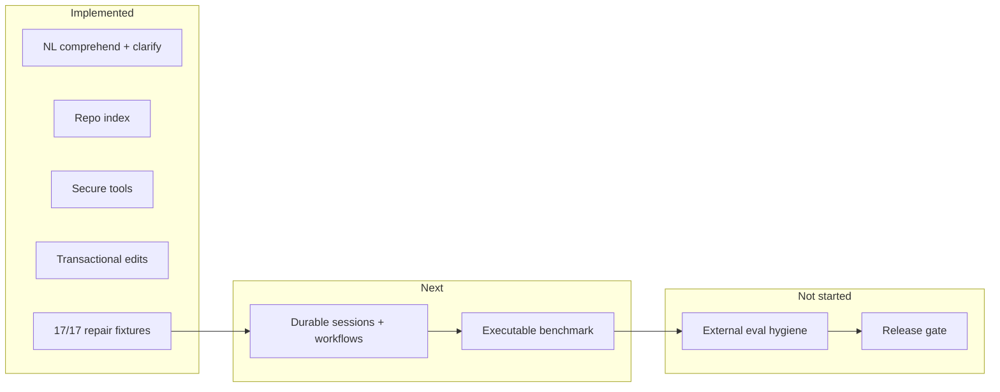

# Universal Coding Agent — Target Definition & Roadmap

**Status:** living plan (2026-06-28)  
**Authority:** extends `MASTER_ROADMAP.md` after **G5 sign-off**  
**Current position:** G5 closed repair loop ✅ — **not** yet a universal agent

---

## 1. What “universal coding agent” means here

An agent is **universal** only when all of the following hold **with executable gates**, not marketing:

| Property | Meaning | Gate |
|----------|---------|------|
| **Comprehend or clarify** | Unseen paraphrases → typed intent, examples, or honest clarification | G1 |
| **Synthesize or repair** | NL + oracle → verified code change, bounded iterations | G5 |
| **Repo-grounded** | Index, retrieve, edit only in policy scope | G2–G4 |
| **Tool-complete** | fs/shell/git/http/db under deny-by-default policy | G3 |
| **Durable** | Multi-turn sessions survive process restart; workflows resume | G6 |
| **Measurable** | Local benchmark resets, runs, scores, artifacts | G7 |
| **Externally credible** | Sealed held-out tasks, no train/test leakage | G8 |
| **Shippable** | CI, security review, install path, no production stubs | G9 |

**Non-goals for “universal”:** matching Cursor/Copilot UX, infinite context, or unverified “success” on ambiguous NL.

---

## 2. Where we are (honest snapshot)

| Layer | State | Evidence |
|-------|-------|----------|
| Synthesis core | Strong, **breadth-limited** | ~25 registry ops; inline-example holdouts; strict verify oracle |
| Repair loop | **G5 complete** | 17/17 nl_fixture workflow nightly |
| MCP / CLI agent | **Production-narrow** | `nsynth_agent_mcp_server.py`, `coding_agent` |
| Sessions | **Experimental** | `.nsynth/sessions/` JSON; clarify API exists |
| Workflows | **Experimental** | `RepoWorkflowRunner`; no durable workflow resume |
| Project scale | **Scaffold** | multifile writer exists; compile gate incomplete on some paths |
| Benchmark harness | **Scaffold** | 20 task manifests; no runner/scoring |
| Synthesis universality | **~15% of Mog surface reachable** | See MASTER_ROADMAP §0.05 U1–U7 |

**Overall:** ~**55%** of a repo-scale agent; ~**15%** of “NL reaches everything the engine can express.”

---

## 3. Package roadmap (G6 → G9)

### Package I — Durable workflows & supervision (G6a)

**Goal:** Agent work survives interruption; supervisor can resume bounded repair runs.

| Deliverable | Acceptance |
|-------------|------------|
| Clarification persist/resume E2E | New process `load` → `--clarify` → synthesis success |
| Auto-persist after every turn | MCP + CLI; snapshot includes `pending` |
| Workflow run checkpoint | `RepoRunSupervisor` writes run id + phase + budget to `.nsynth/runs/` |
| Resume repair from checkpoint | Reload spec + iteration count; no duplicate edits |
| `g6_gate` conformance suite | `cargo test g6_gate --lib` |

**Out of scope:** cross-machine sync, cloud session store.

### Package J — Durable memory (G6b)

| Deliverable | Acceptance |
|-------------|------------|
| Verified experience store | Only cargo-green traces enter memory |
| Session history query | Last N turns with route + outcome |
| Learn-on-the-fly gated reload | Reuse ops only from regression-gated store |

### Package K — Project-scale generation (G6c)

| Deliverable | Acceptance |
|-------------|------------|
| Multifile compile gate on success | No `success:true` without `cargo build` |
| `gencode_normalize` on all transpile paths | Arrays, len, mut params |
| Greenfield route (`GreenfieldProject`) | NL → crate + tests pass |

### Package L — CLI / telemetry (G6d)

| Deliverable | Acceptance |
|-------------|------------|
| Structured JSONL telemetry | route, method, budget, duration per turn |
| Single primary entry | `coding_agent` replaces legacy demo binaries for agent path |
| MCP parity | clarify, resume, repair_summary on all routes |

### Package M — Executable local benchmark (G7)

| Deliverable | Acceptance |
|-------------|------------|
| `repo_agent_bench` binary | reset fixture → run agent → score → artifact JSON |
| 20 standard tasks | From `standard_n_cpu_suite()` |
| Scoring | pass/fail + iterations + wall clock + synthesis method |
| CI tier | fast=3 tasks, nightly=20 |

### Package N — External benchmarks (G8)

| Deliverable | Acceptance |
|-------------|------------|
| Sealed task tarball | No solution leakage |
| HumanEval / MBPP subset adapter | Score + cost report |
| SWE-bench-Lite pilot | Only after G7 green on local analogues |

### Package P — Release (G9)

| Deliverable | Acceptance |
|-------------|------------|
| `nsynth-agent` release artifact | MCP + release binaries |
| Security review checklist | sandbox, HTTP allowlist, no secret exfil |
| Install docs | Cursor MCP config one-liner |

---

## 4. Synthesis universality track (parallel spine)

Repair-loop MVP does **not** require full Mog coverage, but **true universality** does. Ordered levers from MASTER_ROADMAP §0.05:

1. **U2 RUST-GATE** — no surprise `python3` on stock solves  
2. **U3 VALUE-UNIFY** — wire/runtime value alignment  
3. **U4 SPEC-SUMTYPE** — `Problem` targets float/string/array/struct  
4. **U5 op_role + auto-mine** — registry grows from corpus, not hand list  
5. **U6 reference intake** — P2C + reference bodies for unseen ops  
6. **U7 transpile fidelity** — Mog→Rust compiles for all emitted shapes  

Each U-step needs: **holdout verify gate** + **agent path uses same entry** as benchmarks.

---

## 5. Sprint plan (LOOP-19+)

| Loop | Package | Focus | Exit gate |
|------|---------|-------|-----------|
| **LOOP-19** | I | Clarification persist/resume E2E + `g6_gate` | `session_clarification_persist_and_resume` |
| **LOOP-20** | I | Supervisor run checkpoint + resume | resume mid-repair test |
| **LOOP-21** | L | JSONL telemetry + MCP session docs | telemetry file on 3 routes |
| **LOOP-22** | M | First executable bench task (1/20) | `repo_agent_bench --task 0` |
| **LOOP-23** | M | Full 20-task runner + scoring | G7 partial sign-off |
| **LOOP-24** | K | Multifile compile gate on success | multifile NL test green |
| **LOOP-25** | J | Verified experience store | no unverified memory writes |
| **LOOP-26+** | N/P | External eval + release | G8/G9 |

---

## 6. Production tiers (what to deploy when)

| Tier | Audience | Includes | Excludes |
|------|----------|----------|----------|
| **T1 — Tool** (now) | Power users | MCP synthesis, backend build, bounded repair on **your** repo with tests | Arbitrary repo guarantee |
| **T2 — Team** (G6+G7) | Internal eng | Durable sessions, local benchmark dashboard | External benchmark claims |
| **T3 — Product** (G9) | External | Release binaries, security review, docs | Not Cursor parity |

---

## 7. Immediate next actions (LOOP-19)

1. Add `session_clarification_persist_and_resume_across_load` test  
2. Add `agent/g6_gate.rs` conformance module  
3. Wire `ci_smoke.sh` → `g6_gate`  
4. Document MCP multi-turn: query → clarify → query pattern  
5. Begin supervisor checkpoint schema (`.nsynth/runs/<id>.json`)

---

## 8. Success metrics (track weekly)

- NL fixture workflow pass rate (17/17 nightly)  
- G6 session resume tests (target: 5+)  
- G7 benchmark tasks executable (target: 20/20)  
- Registry op count (synthesizable / total)  
- % agent routes that end in verified success vs clarify vs refuse  
- Mean repair iterations on standard suite  

When G6+G7 pass, update MASTER_ROADMAP §0.3 snapshot and graduate Package I/J/L to **Implemented**.
