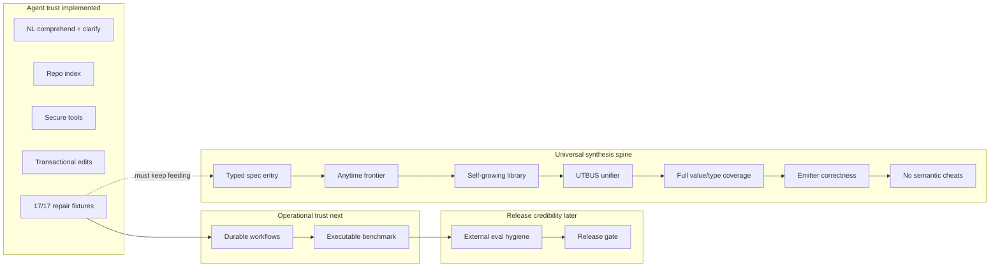

# Universal Coding Agent — Target Definition & Roadmap

**Status:** living plan (2026-06-28)
**Authority:** companion execution view for `MASTER_ROADMAP.md`; if they conflict, update `MASTER_ROADMAP.md` first
**Current position:** G5 closed repair loop ✅; G6 started; LOOP-20A release hygiene ✅; **not** yet a universal coding synthesizer
**North Star:** a **true LLM-free universal coding synthesizer**: native Linguigenesis comprehension + typed program synthesis + verifier-gated self-extension, with external LLMs allowed only as optional, untrusted proposal sources or consumers of verified traces that can never be required for success.

---

## 0. Critical framing: G6–G9 are not the finish line

The roadmap must not accidentally shrink the vision into “a useful MCP coding tool.”

There are two separate tracks:

1. **Agent trust track (G1–G9):** makes the current system durable, measurable, secure, benchmarkable, and releasable for whatever slice it can honestly solve.
2. **Universal synthesis track (U∞):** makes the synthesis core increasingly complete until NL/spec/reference/property → typed verified program works across the whole intended computation model without an LLM core.

Passing **G9** means “safe to release a narrow, honestly-labeled tool.” It does **not** mean universal synthesis is done. The universal coding synthesizer target remains active until the U∞ gates below pass.

---

## 1. What “universal coding synthesizer” means here

The finished system is universal only when **both** the agent shell and the synthesis core satisfy executable gates.

### 1.1 Agent-shell gates

| Property | Meaning | Gate |
|----------|---------|------|
| **Comprehend or clarify** | Unseen paraphrases → typed intent, examples, property, reference, or honest clarification | G1 |
| **Synthesize or repair** | NL/spec + oracle → verified code change, bounded iterations | G5 |
| **Repo-grounded** | Index, retrieve, edit only in policy scope | G2–G4 |
| **Tool-complete** | fs/shell/git/http/db under deny-by-default policy | G3 |
| **Durable** | Multi-turn sessions and workflow runs survive process restart | G6 |
| **Measurable** | Local benchmark resets, runs, scores, artifacts | G7 |
| **Externally credible** | Sealed held-out tasks, no train/test leakage | G8 |
| **Shippable** | CI, security review, install path, no production stubs | G9 |

### 1.2 Synthesis-core gates

| Property | Meaning | Gate |
|----------|---------|------|
| **LLM-free core** | Stock solve path requires no OpenAI/Anthropic/local LLM call, no hidden Python agent runtime, no cloud semantic oracle | U0 |
| **Typed universal entry** | One typed `Problem`/spec/reference/property entry reaches the same verifier-gated solver path | U1 |
| **Open-ended search** | Anytime/resumable frontier can deepen instead of declaring unsolved as impossible | U2 |
| **Self-growing library** | Verified solves mine abstractions that become reusable grammar productions | U3 |
| **UTBUS unification** | Map/filter/fold/scan/zip/branch/call/recursion are synthesized by one typed structural engine, not siloed teachers | U4 |
| **Type/value completeness** | Runtime, verifier, examples, holdouts, and codegen support the full intended value algebra | U5 |
| **Emitter correctness** | Mog → Rust and other targets compile/run for every emitted program shape | U6 |
| **No hardcoded semantic cheats** | Keyword stubs and benchmark-specific recognizers are removed, quarantined, or proven non-authoritative by tests | U7 |
| **External no-leak proof** | Sealed tasks prove generalization without train/test leakage | U8 |

**Non-goals:** a halting oracle, infinite context, marketing-style “success” without a verifier, or claiming Cursor/Copilot UX parity before the synthesis/repo gates prove it.

**Non-negotiables:**

- No LLM may be required in the default synthesis/repair success path.
- No benchmark-specific code path may count as capability.
- No `success:true` without compile/run/property/reference verification.
- No manual phrase table may be treated as understanding; it is at most a temporary data source to be replaced by learned/evidence-ranked Linguigenesis structures.
- A release gate may publish a narrow tool, but it must not rename that slice “universal.”

---

## 2. Where we are (honest snapshot)

| Layer | State | Evidence / blocker |
|-------|-------|--------------------|
| Closed repair loop | **G5 complete** | 17/17 `nl_fixture` workflow passes locally/nightly-scale |
| Sessions | **G6 started** | `.nsynth/sessions/` JSON; clarification persist/resume E2E |
| Workflows | **Experimental** | `RepoWorkflowRunner`; no durable mid-run repair checkpoint yet |
| MCP / CLI agent | **Production-narrow, release-green as of LOOP-20A** | `coding_agent` release build + `ci_smoke.sh` + G5 nightly pass locally; still narrow and must stay gated in CI |
| Benchmark harness | **Scaffold** | 20 task manifests; no `repo_agent_bench` reset/run/score binary yet |
| Project scale | **Scaffold** | multifile writer exists; success paths need compile/test gates everywhere |
| Synthesis core | **Strong but breadth-limited** | strict verifier + real search paths; still many siloed teachers/templates |
| Synthesis universality | **Early** | roughly ~15% of intended Mog/typed surface reachable from the agent path |

**Overall:** roughly **55%** of a trustworthy repo-agent shell, but only **~15%** of the LLM-free universal coding synthesizer vision. That gap is not a failure; it is the core research agenda.

---

## 3. Operational roadmap (G6 → G9; necessary, not sufficient)

### Package I — Durable workflows & supervision (G6a)

**Goal:** Agent work survives interruption; supervisor can resume bounded repair runs.

| Deliverable | Acceptance |
|-------------|------------|
| Clarification persist/resume E2E | New process `load` → `--clarify` → synthesis success |
| Auto-persist after every turn | MCP + CLI; snapshot includes `pending` |
| Workflow run checkpoint | `RepoRunSupervisor` writes run id + phase + budget to `.nsynth/runs/` |
| Resume repair from checkpoint | Reload spec + iteration count; no duplicate edits |
| `g6_gate` conformance suite | `cargo test g6_gate --lib` |

**Out of scope:** cross-machine sync, cloud session store.

### Package J — Durable memory (G6b)

| Deliverable | Acceptance |
|-------------|------------|
| Verified experience store | Only cargo-green / verifier-green traces enter memory |
| Session history query | Last N turns with route + outcome |
| Learn-on-the-fly gated reload | Reuse ops only from regression-gated store |

### Package K — Project-scale generation (G6c)

| Deliverable | Acceptance |
|-------------|------------|
| Multifile compile gate on success | No `success:true` without `cargo build` or target build |
| `gencode_normalize` on all transpile paths | Arrays, len, mut params, helper functions |
| Greenfield route (`GreenfieldProject`) | NL/spec → crate + tests pass |

### Package L — CLI / telemetry (G6d)

| Deliverable | Acceptance |
|-------------|------------|
| Structured JSONL telemetry | route, method, budget, duration per turn |
| Single primary entry | `coding_agent` replaces legacy demo binaries for agent path |
| MCP parity | clarify, resume, repair_summary on all routes |
| Release binary stays green | `cargo build --release --bin coding_agent --bin build_backend_nl` in CI |

### Package M — Executable local benchmark (G7)

| Deliverable | Acceptance |
|-------------|------------|
| `repo_agent_bench` binary | reset fixture → run agent → score → artifact JSON |
| 20 standard tasks | From `standard_n_cpu_suite()` |
| Scoring | pass/fail + iterations + wall clock + synthesis method |
| CI tier | fast=3 tasks, nightly=20 |

### Package N — External benchmarks (G8)

| Deliverable | Acceptance |
|-------------|------------|
| Sealed task tarball | No solution leakage |
| HumanEval / MBPP subset adapter | Score + cost report |
| SWE-bench-Lite pilot | Only after G7 green on local analogues |

### Package P — Release (G9)

| Deliverable | Acceptance |
|-------------|------------|
| `nsynth-agent` release artifact | MCP + release binaries |
| Security review checklist | sandbox, HTTP allowlist, no secret exfil |
| Install docs | Cursor/Claude Desktop MCP config one-liner |
| Honest claim matrix | clearly states which tasks are supported, refused, or experimental |

---

## 4. North-star synthesis roadmap (U∞; the true vision)

Repair-loop MVP does **not** require full Mog/typed-program coverage, but a universal coding synthesizer does. This track must remain active in parallel with G6–G9.

| Package | Focus | Acceptance |
|---------|-------|------------|
| **Q — No-LLM invariant** | Make the default solve/repair path provably LLM-free | Grep/build gate: no default OpenAI/Anthropic/local-LLM calls; Python bridges opt-in only; stock tests pass with LLM/network env unset |
| **R — UTBUS parity** | Prove unified typed bottom-up search can match current siloed teachers on local benchmark slices | UTBUS solves the parity suite without teacher-specific dispatch |
| **S — Higher-order synthesis** | Same engine synthesizes λ-bodies for map/filter/fold/scan/zipWith | New held-out array/string/struct tasks solved by recursively synthesized bodies |
| **T — Calls, recursion, and modules** | Function calls, helper synthesis, recursion schemes, multi-function code | Multi-function recursive programs compile and verify without per-op recognizers |
| **V — Type/value closure** | Full `Value` algebra: tuples, structs, enums, options/results, trees, strings, floats, arrays | Generated holdouts/equality are type-driven and non-vacuous for each variant |
| **W — Verified self-extension** | Solves mine reusable abstractions and promote them through regression gates | A fresh later process reuses a mined abstraction and passes a held-out regression suite |
| **X — Cheat retirement** | Remove/quarantine keyword stubs, phrase recognizers, hardcoded fixtures | Capability tests fail if fallback stubs are the only path; fallback count trends to zero |
| **Y — Sealed synthesis eval** | Generalization on tasks unknown to the repo and to the registry | Locked task tarball + artifact report, no solution leakage |

A phase only counts if the **same agent path** used by benchmarks and MCP reaches it. A solver-only demo that is walled off from the agent is useful research evidence, not agent capability.

### 4.1 Optional LLM-empowerment track (allowed, not core)

The user is open to nCPU becoming a tool that makes LLMs better at coding and logic. That is compatible with the North Star only if the relationship is one-way:

- **nCPU remains the verifier/synthesizer of record.** An LLM may propose specs, candidates, or explanations, but every accepted artifact must pass native synthesis/verification gates without depending on the LLM.
- **LLMs may consume proof artifacts.** Expose typed specs, counterexamples, repair traces, synthesized programs, mined abstractions, and verifier failures as MCP/CLI outputs for model feedback, fine-tuning datasets, or live tool use.
- **No hidden fallback.** If an LLM-generated candidate passes, credit is “verified external proposal”; if it fails, nCPU returns the counterexample/refusal rather than laundering it into success.

| Lane | Focus | Acceptance |
|------|-------|------------|
| **LME-1 — Verified oracle tool** | MCP/CLI endpoint for synthesize/verify/explain/counterexample | LLM caller can ask for a solve or verification and receives machine-checkable JSON, never prose-only success |
| **LME-2 — Trace dataset** | Export verified solves/failures for coding-logic training | JSONL contains spec, candidate/proof, counterexamples, method, budget, and no leaked sealed solutions |
| **LME-3 — Model feedback loop** | Let LLMs use nCPU as a critic/search partner | Eval shows an LLM+ nCPU loop improves pass rate while the stock no-LLM nCPU path remains green |

---

## 5. Sprint plan (LOOP-20+)

**LOOP-20A closed on 2026-06-28.** The release/CI blockers found in review are now fixed: `coding_agent` compiles in release, `scripts/nsynth_g5_nightly.sh` uses valid cargo invocations, `ci_smoke.sh` is green, and the full G5 nightly corpus is green locally.

| Loop | Package | Focus | Exit gate |
|------|---------|-------|-----------|
| **LOOP-20A** | L/P hygiene | **DONE:** release/CI script blockers cleared | release build + `ci_smoke.sh` + G5 nightly green |
| **LOOP-20** | I | Supervisor run checkpoint + resume | resume mid-repair test |
| **LOOP-21** | L | JSONL telemetry + MCP session docs | telemetry file on 3 routes |
| **LOOP-22** | M | First executable bench task (1/20) | `repo_agent_bench --task 0` |
| **LOOP-23** | M | Full 20-task runner + scoring | G7 partial sign-off |
| **LOOP-24** | K | Multifile compile gate on success | multifile NL test green |
| **LOOP-25** | J/W | Verified experience store | no unverified memory writes; reuse only verifier-green traces |
| **LOOP-26+** | Q/R/S | No-LLM invariant + UTBUS parity/higher-order synthesis | U-track gates trend upward, not just agent UX |
| **LOOP-30+** | N/P/Y | External eval + release | G8/G9 with honest claim matrix |

---

## 6. Production tiers (what to deploy when)

| Tier | Audience | Includes | Must not claim |
|------|----------|----------|----------------|
| **T1 — Tool** (now) | Power users | MCP synthesis, backend build, bounded repair on repos with tests | arbitrary repo guarantee |
| **T2 — Team** (G6+G7) | Internal eng | durable sessions, local benchmark dashboard | external benchmark credibility |
| **T3 — Product** (G9) | External | release binaries, security review, docs, honest support matrix | universal coding synthesizer |
| **T4 — Universal Synthesizer** (U∞) | Research/product breakthrough | LLM-free typed synthesis across the intended value/program surface, verified self-extension, sealed evals | halting oracle or unverified success |

---

## 7. Success metrics (track weekly)

Agent trust metrics:

- NL fixture workflow pass rate (17/17 nightly)
- G6 session/workflow resume tests
- G7 benchmark tasks executable (target: 20/20)
- % agent routes ending in verified success vs clarify vs refuse
- Mean repair iterations on standard suite

Universal synthesis metrics:

- No-LLM stock solve gate status
- % of Mog AST/value/type surface reachable from the **agent path**
- Number of siloed teachers replaced by UTBUS productions
- Hardcoded semantic fallback count, trending down
- Verified mined abstractions promoted and reused across fresh processes
- Held-out/sealed task pass rate with leakage audit

When G6+G7 pass, update `MASTER_ROADMAP.md` §0.3, but do **not** mark the universal synthesizer done. Only the U∞ gates can close that vision.
