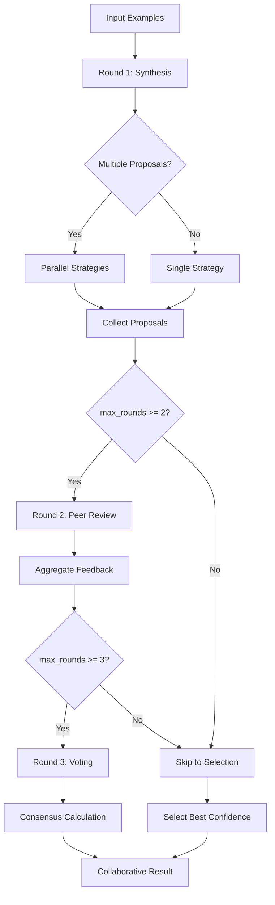

# Multi-Agent Orchestrator Documentation

## Table of Contents
1. [Overview](#overview)
2. [Architecture](#architecture)
3. [Agent Types](#agent-types)
4. [Communication Protocol](#communication-protocol)
5. [Solving Workflow](#solving-workflow)
6. [Configuration](#configuration)
7. [Usage Examples](#usage-examples)
8. [Extension Points](#extension-points)
9. [Testing](#testing)

---

## Overview

The Multi-Agent Orchestrator is a collaborative problem-solving system that coordinates specialized agents through structured communication and voting mechanisms. It enables multiple AI agents with complementary capabilities to work together on synthesis tasks, improving solution quality through peer review and consensus building.

### Key Features
- **Collaborative Synthesis**: Multiple agents propose and refine solutions
- **Peer Review**: Each solution is evaluated by specialized reviewers
- **Consensus Building**: Voting mechanism selects the best solution
- **Parallel Execution**: Multiple agents can work simultaneously
- **Configurable Workflow**: Adjustable rounds, timeouts, and thresholds

---

## Architecture

### System Diagram

```
┌─────────────────────────────────────────────────────────────────┐
│                        Orchestrator                               │
│  ┌────────────────────────────────────────────────────────────┐  │
│  │              Communication Channel (Async)                  │  │
│  │  ┌──────────┐  ┌──────────┐  ┌──────────┐  ┌──────────┐   │  │
│  │  │ Proposal │  │  Review  │  │   Vote   │  │  Task    │   │  │
│  │  │ Messages│  │ Messages │  │ Messages │  │  Start   │   │  │
│  │  └──────────┘  └──────────┘  └──────────┘  └──────────┘   │  │
│  └────────────────────────────────────────────────────────────┘  │
└─────────────────────────────────────────────────────────────────┘
                              │
        ┌─────────────────────┼─────────────────────┐
        │                     │                     │
        ▼                     ▼                     ▼
┌──────────────┐    ┌──────────────┐    ┌──────────────┐
│  Round 1     │    │  Round 2     │    │  Round 3     │
│  Synthesis   │───▶│  Review      │───▶│  Voting      │
│              │    │              │    │              │
│ ┌──────────┐ │    │ ┌──────────┐ │    │ ┌──────────┐ │
│ │Multiple  │ │    │ │Peer      │ │    │ │Consensus │ │
│ │Strategies│ │    │ │Feedback  │ │    │ │Selection │ │
│ └──────────┘ │    │ └──────────┘ │    │ └──────────┘ │
└──────────────┘    └──────────────┘    └──────────────┘
```

### Agent Ecosystem

```
┌─────────────────────────────────────────────────────────────────────┐
│                         Agent Ecosystem                               │
│                                                                      │
│  ┌──────────────┐                                                   │
│  │ Synthesizer  │─── Generates initial solutions                    │
│  │              │    - Direct synthesis                              │
│  │              │    - Pattern-based                                │
│  │              │    - Recursive/Iterative strategies                │
│  └──────────────┘                                                   │
│                                                                      │
│  ┌──────────────┐  ┌──────────────┐  ┌──────────────┐             │
│  │  Debugger    │  │  Optimizer   │  │ SecurityExpert│             │
│  │              │  │              │  │              │             │
│  │ Logic errors │  │ Performance  │  │ Safety       │             │
│  │ Trace analysis│  │ Complexity   │  │ Correctness  │             │
│  └──────────────┘  └──────────────┘  └──────────────┘             │
│                                                                      │
│  ┌──────────────┐  ┌──────────────┐  ┌──────────────┐             │
│  │   Tester     │  │  Documenter  │  │   Reviewer   │             │
│  │              │  │              │  │              │             │
│  │ Test cases   │  │ Explanation  │  │ Aggregation  │             │
│  │ Edge cases   │  │ Clarity      │  │ Consensus    │             │
│  └──────────────┘  └──────────────┘  └──────────────┘             │
│                                                                      │
└─────────────────────────────────────────────────────────────────────┘
```

### Core Components

```rust
// Main orchestrator structure
pub struct Orchestrator {
    agents: Vec<Agent>,                              // Registered agents
    communication_channel: Arc<RwLock<CommunicationChannel>>,  // Message bus
    config: OrchestratorConfig,                      // Configuration
}

// Communication infrastructure
pub struct CommunicationChannel {
    tx: mpsc::UnboundedSender<AgentMessage>,         // Transmit channel
    rx: Arc<RwLock<mpsc::UnboundedReceiver<AgentMessage>>>,  // Receive
    message_log: Arc<RwLock<Vec<AgentMessage>>>,     // Audit trail
}
```

---

## Agent Types

The orchestrator includes 7 specialized agent types, each with unique capabilities:

### 1. Synthesizer
**Purpose**: Core synthesis agent - generates initial solutions

**Capabilities**:
- `synthesis` - Primary solution generation
- `code_generation` - Produces executable code
- `pattern_matching` - Recognizes and applies patterns

**Role in Workflow**: Initiates the solving process by generating multiple solution proposals using different strategies (direct, recursive, iterative, pattern-based).

### 2. Debugger
**Purpose**: Debugging specialist - identifies and fixes logic errors

**Capabilities**:
- `error_detection` - Finds logic and runtime errors
- `logic_analysis` - Analyzes control flow and logic paths
- `trace_analysis` - Evaluates execution traces

**Role in Workflow**: Reviews proposals for potential bugs, edge cases, and logical inconsistencies.

### 3. Optimizer
**Purpose**: Optimization specialist - improves efficiency

**Capabilities**:
- `performance_optimization` - Enhances execution speed
- `complexity_reduction` - Reduces algorithmic complexity
- `resource_efficiency` - Minimizes memory and resource usage

**Role in Workflow**: Evaluates solutions for performance characteristics and suggests improvements.

### 4. SecurityExpert
**Purpose**: Security expert - validates safety and correctness

**Capabilities**:
- `safety_validation` - Ensures code safety properties
- `correctness_proofs` - Validates logical correctness
- `threat_detection` - Identifies potential vulnerabilities

**Role in Workflow**: Analyzes solutions for security implications and correctness guarantees.

### 5. Tester
**Purpose**: Testing specialist - generates comprehensive tests

**Capabilities**:
- `test_generation` - Creates test cases
- `edge_case_detection` - Identifies boundary conditions
- `coverage_analysis` - Measures test coverage

**Role in Workflow**: Ensures solutions are testable and validates edge case handling.

### 6. Documenter
**Purpose**: Documentation specialist - ensures clear explanations

**Capabilities**:
- `documentation` - Generates documentation
- `explanation_generation` - Creates clear explanations
- `readability_analysis` - Evaluates code clarity

**Role in Workflow**: Assesses solution readability and documentation quality.

### 7. Reviewer
**Purpose**: Review coordinator - aggregates feedback

**Capabilities**:
- `code_review` - Performs comprehensive code review
- `feedback_aggregation` - Combines multiple feedback sources
- `consensus_building` - Facilitates agreement

**Role in Workflow**: Coordinates the review process and helps build consensus among agents.

### Agent Registration

```rust
// All agents are automatically registered
let agents = Agent::create_all();
// Returns: Vec<Agent> with all 7 agent types

// Custom agents can be added
orchestrator.add_agent(custom_agent);
```

---

## Communication Protocol

### AgentMessage Enum

All inter-agent communication uses the `AgentMessage` enum:

```rust
#[derive(Debug, Clone)]
pub enum AgentMessage {
    /// Request to start a task with the given examples
    TaskStart {
        examples: Vec<(Vec<serde_json::Value>, i64)>,
        timeout_s: u64,
    },

    /// Partial solution proposal from an agent
    Proposal {
        agent_id: AgentId,
        solution: String,
        confidence: f64,
        metadata: serde_json::Value,
    },

    /// Request for peer review of a proposal
    ReviewRequest {
        proposal: String,
        from_agent: AgentId,
    },

    /// Review feedback response
    ReviewResponse {
        from_agent: AgentId,
        approved: bool,
        feedback: String,
        score: f64,
    },

    /// Vote on the best solution
    Vote {
        agent_id: AgentId,
        preferred_solution: usize,
        rationale: String,
    },

    /// Final decision notification
    FinalDecision {
        solution: String,
        consensus_score: f64,
    },

    /// Error or abort signal
    Error(SolverError),
}
```

### Message Flow Diagram

```
Round 1: Synthesis Phase
─────────────────────────────────────────────────────────
Orchestrator           Synthesizer              All Agents
    │                       │                        │
    ├──TaskStart──────────▶│                        │
    │                       │                        │
    │◄──Proposal────────────┤ (multiple strategies)  │
    │                       │                        │

Round 2: Review Phase
─────────────────────────────────────────────────────────
Orchestrator           Reviewer Agents          Proposals
    │                       │                        │
    ├──ReviewRequest──────▶│                        │
    │                       ├──analyze──────────────▶│
    │                       │                        │
    │◄──ReviewResponse──────┤◄───────────────────────┤
    │                       │                        │

Round 3: Voting Phase
─────────────────────────────────────────────────────────
Orchestrator           All Agents              Proposals
    │                       │                        │
    ├──RequestVote─────────▶│                       │
    │                       ├──evaluate─────────────▶│
    │                       │                        │
    │◄──Vote────────────────┤◄───────────────────────┤
    │                       │                        │
    ├──FinalDecision───────▶│                        │
```

### AgentId Enum

```rust
#[derive(Debug, Clone, Copy, PartialEq, Eq, Hash, PartialOrd, Ord)]
pub enum AgentId {
    Synthesizer,
    Debugger,
    Optimizer,
    SecurityExpert,
    Tester,
    Documenter,
    Reviewer,
}
```

---

## Solving Workflow

The orchestrator follows a 3-round collaborative solving process:

### Round 1: Initial Synthesis

```
┌─────────────────────────────────────────────────────────┐
│                    Round 1: Synthesis                    │
└─────────────────────────────────────────────────────────┘
                              │
                              ▼
              ┌──────────────────────────┐
              │  Broadcast TaskStart     │
              │  - Examples              │
              │  - Timeout settings      │
              └──────────────────────────┘
                              │
                              ▼
              ┌──────────────────────────┐
              │  Parallel Synthesis      │
              │  (if enabled)             │
              ├──────────────────────────┤
              │ • Direct strategy        │
              │ • Recursive strategy     │
              │ • Iterative strategy     │
              │ • Pattern-based strategy │
              └──────────────────────────┘
                              │
                              ▼
              ┌──────────────────────────┐
              │  Collect Proposals       │
              │  - Code                  │
              │  - Confidence scores     │
              │  - Metadata              │
              └──────────────────────────┘
```

**Key Behaviors**:
- If `enable_parallel` is true, generates multiple proposals with different strategies
- Each proposal includes a confidence score (0.0 - 1.0)
- Metadata tracks the strategy used and generation parameters

### Round 2: Peer Review and Refinement

```
┌─────────────────────────────────────────────────────────┐
│                   Round 2: Review                         │
└─────────────────────────────────────────────────────────┘
                              │
                              ▼
              ┌──────────────────────────┐
              │  For each proposal:      │
              └──────────────────────────┘
                              │
              ┌───────────────┴───────────────┐
              ▼                               ▼
    ┌──────────────────┐          ┌──────────────────┐
    │  Debugger Review │          │ Security Review  │
    │  • Logic errors  │          │  • Safety        │
    │  • Edge cases    │          │  • Correctness   │
    └──────────────────┘          └──────────────────┘
              │                               │
              └───────────────┬───────────────┘
                              ▼
    ┌──────────────────┐          ┌──────────────────┐
    │  Optimizer Review│          │  Tester Review    │
    │  • Performance   │          │  • Test cases     │
    │  • Complexity    │          │  • Coverage       │
    └──────────────────┘          └──────────────────┘
              │                               │
              └───────────────┬───────────────┘
                              ▼
              ┌──────────────────────────┐
              │  Aggregate Feedback     │
              │  - Approval status      │
              │  - Scores (0-1)         │
              │  - Issues found         │
              └──────────────────────────┘
```

**Key Behaviors**:
- Each proposal is reviewed by all agents except the original synthesizer
- Reviewers provide:
  - `approved`: Boolean approval decision
  - `score`: Numeric quality assessment (0.0 - 1.0)
  - `feedback`: Textual explanation
  - `issues_found`: Count of identified problems

### Round 3: Voting and Consensus

```
┌─────────────────────────────────────────────────────────┐
│                   Round 3: Voting                        │
└─────────────────────────────────────────────────────────┘
                              │
                              ▼
              ┌──────────────────────────┐
              │  Request Votes from      │
              │  all agents              │
              └──────────────────────────┘
                              │
                              ▼
              ┌──────────────────────────┐
              │  Each agent selects:     │
              │  - Best proposal index   │
              │  - Rationale             │
              │  - Weight (by default)   │
              └──────────────────────────┘
                              │
                              ▼
              ┌──────────────────────────┐
              │  Tally Votes             │
              │  - Count per proposal   │
              │  - Identify winner       │
              └──────────────────────────┘
                              │
                              ▼
              ┌──────────────────────────┐
              │  Calculate Consensus     │
              │  score = votes_for_winner│
              │           / total_votes  │
              └──────────────────────────┘
                              │
                              ▼
              ┌──────────────────────────┐
              │  Return Result            │
              │  - Final code            │
              │  - Consensus score       │
              │  - All proposals         │
              │  - Vote records          │
              └──────────────────────────┘
```

**Key Behaviors**:
- Each agent votes for their preferred solution
- Simple plurality voting selects the winner
- Consensus score measures agreement level
- If voting is disabled (max_rounds < 3), highest confidence solution is selected

### Complete Workflow Summary



---

## Configuration

### OrchestratorConfig

```rust
#[derive(Debug, Clone)]
pub struct OrchestratorConfig {
    /// Maximum number of collaboration rounds
    pub max_rounds: usize,

    /// Minimum consensus threshold (0.0 - 1.0)
    pub consensus_threshold: f64,

    /// Timeout for individual agent tasks (seconds)
    pub agent_timeout_s: u64,

    /// Whether to enable parallel agent execution
    pub enable_parallel: bool,

    /// Number of parallel workers
    pub parallel_workers: usize,
}
```

### Default Configuration

```rust
impl Default for OrchestratorConfig {
    fn default() -> Self {
        Self {
            max_rounds: 3,              // Full 3-round workflow
            consensus_threshold: 0.7,   // 70% agreement desired
            agent_timeout_s: 30,        // 30 seconds per agent
            enable_parallel: true,     // Enable parallel synthesis
            parallel_workers: 4,        // 4 parallel workers
        }
    }
}
```

### Configuration Options

#### max_rounds

Controls the depth of collaboration:
- `1`: Synthesis only (no review or voting)
- `2`: Synthesis + review (no voting)
- `3`: Full workflow (synthesis + review + voting)

**Trade-offs**:
- Higher values → Better quality, longer runtime
- Lower values → Faster results, less validation

#### consensus_threshold

Minimum agreement level for solution acceptance:
- Range: 0.0 (unanimous not required) to 1.0 (must have full agreement)
- Default: 0.7 (70% agreement)

**Usage**:
```rust
// High consensus requirement (critical systems)
let config = OrchestratorConfig {
    consensus_threshold: 0.9,
    ..Default::default()
};

// Lower consensus (exploration/prototyping)
let config = OrchestratorConfig {
    consensus_threshold: 0.5,
    ..Default::default()
};
```

#### agent_timeout_s

Per-agent time limit in seconds:
- Default: 30 seconds
- Adjust based on task complexity

**Usage**:
```rust
// Quick tasks
let config = OrchestratorConfig {
    agent_timeout_s: 10,
    ..Default::default()
};

// Complex synthesis
let config = OrchestratorConfig {
    agent_timeout_s: 120,  // 2 minutes
    ..Default::default()
};
```

#### enable_parallel

Controls parallel synthesis:
- `true`: Generate multiple proposals simultaneously
- `false`: Single proposal, faster execution

**Trade-offs**:
- Parallel → More proposal diversity, higher resource usage
- Sequential → Faster, less diversity

#### parallel_workers

Number of parallel workers when parallel is enabled:
- Default: 4 workers
- Adjust based on available CPU cores

### Configuration Examples

```rust
// Quick exploration mode
let quick_config = OrchestratorConfig {
    max_rounds: 2,
    agent_timeout_s: 15,
    enable_parallel: false,
    ..Default::default()
};

// High-quality mode for critical systems
let quality_config = OrchestratorConfig {
    max_rounds: 3,
    consensus_threshold: 0.9,
    agent_timeout_s: 60,
    enable_parallel: true,
    parallel_workers: 8,
};

// Balanced mode (default)
let balanced_config = OrchestratorConfig::default();
```

---

## Usage Examples

### Basic Usage

```rust
use nsynth::agent::orchestrator::{Orchestrator, OrchestratorConfig};
use serde_json::json;

#[tokio::main]
async fn main() -> Result<(), Box<dyn std::error::Error>> {
    // Create orchestrator with default config
    let orchestrator = Orchestrator::new();

    // Define examples (input -> output pairs)
    let examples = vec![
        (vec![json!(2), json!(3)], 5),   // 2 + 3 = 5
        (vec![json!(5), json!(7)], 12),  // 5 + 7 = 12
    ];

    // Solve collaboratively
    let result = orchestrator.solve_collaborative(examples).await?;

    println!("Final solution:\n{}", result.final_code);
    println!("Consensus score: {:.2}", result.consensus_score);
    println!("Participating agents: {:?}", result.participating_agents);
    println!("Total rounds: {}", result.total_rounds);
    println!("Elapsed time: {}ms", result.elapsed_ms);

    Ok(())
}
```

### Custom Configuration

```rust
// Create orchestrator with custom configuration
let config = OrchestratorConfig {
    max_rounds: 2,              // Skip voting round
    consensus_threshold: 0.6,    // Lower consensus requirement
    agent_timeout_s: 45,        // Longer timeout
    enable_parallel: true,      // Enable parallel synthesis
    parallel_workers: 6,       // More workers
};

let orchestrator = Orchestrator::with_config(config);
let result = orchestrator.solve_collaborative(examples).await?;
```

### Adding Custom Agents

```rust
use nsynth::agent::orchestrator::{Agent, AgentId};

let mut orchestrator = Orchestrator::new();

// Add a custom domain expert agent
orchestrator.add_agent(Agent::Synthesizer {
    id: AgentId::Synthesizer,  // Or custom AgentId if extended
    capabilities: vec![
        "domain_synthesis".to_string(),
        "specialized_patterns".to_string(),
    ],
});

// Now the orchestrator has 8 agents instead of 7
println!("Total agents: {}", orchestrator.agents().len());
```

### Processing Results

```rust
let result = orchestrator.solve_collaborative(examples).await?;

// Access final solution
let code = result.final_code;

// Check consensus level
if result.consensus_score < 0.8 {
    println!("Warning: Low consensus - consider manual review");
}

// Examine all proposals
for (idx, proposal) in result.proposals.iter().enumerate() {
    println!("Proposal {}: {} confidence", idx, proposal.confidence);
    println!("  Reviews: {} evaluations", proposal.reviews.len());

    for (agent_id, feedback) in &proposal.reviews {
        println!("    {}: {} (score: {:.2})",
                 agent_id,
                 if feedback.approved { "✓" } else { "✗" },
                 feedback.score);
    }
}

// Analyze voting patterns
for vote in &result.votes {
    println!("{} voted for solution #{}: {}",
             vote.agent_id,
             vote.preferred_solution,
             vote.rationale);
}
```

### Error Handling

```rust
use nsynth::solver::SolverError;

match orchestrator.solve_collaborative(examples).await {
    Ok(result) => {
        println!("Solution found with {:.1}% consensus",
                 result.consensus_score * 100.0);
    }
    Err(SolverError::NoSolutionFound(msg)) => {
        eprintln!("No solution found: {}", msg);
        // Handle no-solution case
    }
    Err(SolverError::CommunicationError(msg)) => {
        eprintln!("Communication failure: {}", msg);
        // Handle communication errors
    }
    Err(SolverError::ConfigurationError(msg)) => {
        eprintln!("Configuration error: {}", msg);
        // Handle configuration issues
    }
    Err(e) => {
        eprintln!("Unexpected error: {}", e);
    }
}
```

---

## Extension Points

### Adding New Agent Types

To add a new agent type, extend the `AgentId` and `Agent` enums:

```rust
// 1. Add to AgentId enum
#[derive(Debug, Clone, Copy, PartialEq, Eq, Hash, PartialOrd, Ord)]
pub enum AgentId {
    Synthesizer,
    Debugger,
    Optimizer,
    SecurityExpert,
    Tester,
    Documenter,
    Reviewer,
    // Add your custom agent
    DomainExpert,
}

// 2. Add Display implementation
impl std::fmt::Display for AgentId {
    fn fmt(&self, f: &mut std::fmt::Formatter<'_>) -> std::fmt::Result {
        match self {
            // ... existing cases ...
            AgentId::DomainExpert => write!(f, "DomainExpert"),
        }
    }
}

// 3. Add to Agent enum
#[derive(Debug, Clone)]
pub enum Agent {
    // ... existing variants ...
    DomainExpert {
        id: AgentId,
        capabilities: Vec<String>,
    },
}

// 4. Update Agent methods
impl Agent {
    pub fn id(&self) -> AgentId {
        match self {
            // ... existing cases ...
            Agent::DomainExpert { id, .. } => *id,
        }
    }

    pub fn capabilities(&self) -> &[String] {
        match self {
            // ... existing cases ...
            Agent::DomainExpert { capabilities, .. } => capabilities,
        }
    }
}
```

### Custom Review Logic

To implement custom review logic for your agent:

```rust
// Extend simulate_agent_review method
async fn simulate_agent_review(
    &self,
    agent_id: AgentId,
    proposal: &SolutionProposal,
) -> Result<ReviewFeedback, SolverError> {
    let (approved, score, issues) = match agent_id {
        AgentId::DomainExpert => {
            // Custom review logic
            let issues = analyze_domain_specific_issues(&proposal.code);
            let approved = issues.is_empty();
            let score = if approved { 0.95 } else { 0.65 };
            (approved, score, issues.len())
        }
        // ... existing cases ...
        _ => (true, 0.8, 0),
    };

    Ok(ReviewFeedback {
        approved,
        feedback: format!("Reviewed by {}", agent_id),
        score,
        issues_found: issues,
    })
}
```

### Custom Voting Strategies

To implement custom voting logic:

```rust
// Extend select_best_proposal method
async fn select_best_proposal(
    &self,
    agent_id: AgentId,
    proposals: &[SolutionProposal],
) -> usize {
    match agent_id {
        AgentId::DomainExpert => {
            // Custom selection logic
            // E.g., prefer proposals with specific metadata
            proposals
                .iter()
                .enumerate()
                .filter(|(_, p)| {
                    p.metadata.get("domain_specific")
                        .and_then(|v| v.as_bool())
                        .unwrap_or(false)
                })
                .max_by(|a, b| {
                    a.1.confidence.partial_cmp(&b.1.confidence).unwrap()
                })
                .map(|(idx, _)| idx)
                .unwrap_or(0)
        }
        // ... default logic ...
        _ => {
            // Default: select by average review score
            let mut best_idx = 0;
            let mut best_score = 0.0f64;
            for (idx, proposal) in proposals.iter().enumerate() {
                let avg_score: f64 = proposal
                    .reviews
                    .values()
                    .map(|r| r.score)
                    .sum::<f64>()
                    / proposal.reviews.len().max(1) as f64;
                if avg_score > best_score {
                    best_score = avg_score;
                    best_idx = idx;
                }
            }
            best_idx
        }
    }
}
```

### Custom Communication Messages

To add custom message types:

```rust
// Extend AgentMessage enum
#[derive(Debug, Clone)]
pub enum AgentMessage {
    // ... existing variants ...

    // Custom message for domain-specific queries
    DomainQuery {
        query: String,
        context: serde_json::Value,
    },

    // Custom response
    DomainResponse {
        agent_id: AgentId,
        result: serde_json::Value,
    },
}
```

### Custom Consensus Calculation

To implement custom consensus metrics:

```rust
// Extend calculate_consensus method
fn calculate_consensus(
    &self,
    votes: &[SolutionVote],
    selected: &SolutionProposal,
) -> f64 {
    // Custom consensus calculation
    // E.g., weighted consensus based on agent expertise
    let weighted_votes: f64 = votes
        .iter()
        .filter(|v| v.preferred_solution == selected.agent_id as usize)
        .map(|v| v.weight)
        .sum();

    let total_weight: f64 = votes.iter().map(|v| v.weight).sum();

    if total_weight > 0.0 {
        weighted_votes / total_weight
    } else {
        0.0
    }
}
```

---

## Testing

The orchestrator includes comprehensive tests:

### Running Tests

```bash
# Run all orchestrator tests
cargo test orchestrator

# Run with output
cargo test orchestrator -- --nocapture

# Run specific test
cargo test test_orchestrator_creation
```

### Test Coverage

```rust
// Test: Orchestrator creation
#[tokio::test]
async fn test_orchestrator_creation() {
    let orchestrator = Orchestrator::new();
    assert_eq!(orchestrator.agents().len(), 7);
}

// Test: Communication channel
#[tokio::test]
async fn test_communication_channel() {
    let channel = CommunicationChannel::new();
    channel.send(AgentMessage::TaskStart {
        examples: vec![],
        timeout_s: 10,
    }).await.unwrap();

    let msg = channel.recv().await;
    assert!(msg.is_some());
}

// Test: Collaborative solving
#[tokio::test]
async fn test_collaborative_solving() {
    let orchestrator = Orchestrator::with_config(OrchestratorConfig {
        max_rounds: 2,
        consensus_threshold: 0.6,
        ..Default::default()
    });

    let examples = vec![
        (vec![json!(2), json!(3)], 5),
        (vec![json!(5), json!(7)], 12),
    ];

    let result = orchestrator.solve_collaborative(examples).await;
    assert!(result.is_ok());

    let result = result.unwrap();
    assert!(!result.final_code.is_empty());
    assert_eq!(result.participating_agents.len(), 7);
}

// Test: Agent capabilities
#[tokio::test]
async fn test_agent_capabilities() {
    let agents = Agent::create_all();
    assert!(agents.iter().any(|a| matches!(a, Agent::Synthesizer { .. })));
    assert!(agents.iter().any(|a| matches!(a, Agent::SecurityExpert { .. })));

    let synthesizer = agents
        .iter()
        .find(|a| matches!(a, Agent::Synthesizer { .. }))
        .unwrap();
    assert!(synthesizer.capabilities().contains(&"synthesis".to_string()));
}
```

---

## Performance Considerations

### Parallel Execution

When `enable_parallel = true`, the orchestrator spawns multiple synthesis attempts simultaneously. This increases:
- **Throughput**: More proposals generated per unit time
- **Resource usage**: Higher CPU and memory consumption
- **Solution diversity**: Different strategies explore the solution space

Recommendations:
- Enable for complex problems requiring thorough exploration
- Disable for quick prototypes or simple problems
- Adjust `parallel_workers` based on available cores

### Timeout Management

The `agent_timeout_s` setting controls per-agent time limits:
- Too short: Agents may time out before finding good solutions
- Too long: Wasted time on unproductive searches

Recommendations:
- Start with default (30s) and adjust based on observed behavior
- Monitor `elapsed_ms` in results to gauge actual time usage
- Consider problem complexity when setting timeouts

### Round Configuration

The `max_rounds` setting affects both quality and performance:
- Round 1 (synthesis): Always required
- Round 2 (review): Adds validation but increases time
- Round 3 (voting): Adds consensus but requires multiple proposals

Recommendations:
- Use `max_rounds = 3` for critical systems requiring high confidence
- Use `max_rounds = 2` for balanced quality/speed
- Use `max_rounds = 1` for rapid prototyping

---

## Error Handling

The orchestrator uses `SolverError` for error reporting:

```rust
pub enum SolverError {
    /// No agent produced a valid solution
    NoSolutionFound(String),

    /// Communication channel failure
    CommunicationError(String),

    /// Configuration error
    ConfigurationError(String),

    /// Agent timeout
    Timeout(String),

    /// Generic error
    Error(String),
}
```

Error recovery strategies:
- **NoSolutionFound**: Try with different examples or increase timeout
- **CommunicationError**: Check channel configuration and retry
- **ConfigurationError**: Validate config parameters before use
- **Timeout**: Increase `agent_timeout_s` or simplify examples

---

## Best Practices

1. **Start with defaults**: Use `OrchestratorConfig::default()` for initial testing
2. **Monitor consensus**: Low consensus scores may indicate ambiguous problems
3. **Review all proposals**: Don't just take the winner—examine alternatives
4. **Adjust timeouts**: Balance between exploration and speed
5. **Use parallel for complex problems**: Enable parallel synthesis for challenging tasks
6. **Validate results**: Always verify generated solutions against original examples
7. **Handle errors gracefully**: Always handle `SolverError` appropriately

---

## Future Enhancements

Potential areas for extension:
1. **Dynamic agent selection**: Choose agents based on problem characteristics
2. **Learning from feedback**: Improve agent selection based on historical performance
3. **Hierarchical orchestration**: Nested orchestrators for complex problems
4. **Cross-agent negotiation**: Agents can negotiate and combine solutions
5. **Real-time monitoring**: Stream status updates during solving
6. **Persistent results**: Save and load previous solving sessions
7. **Distributed execution**: Run agents across multiple machines

---

## References

- **Source**: `/Users/bobbyprice/projects/nCPU/nsynth/src/agent/orchestrator.rs`
- **Related**: `solver.rs`, `pipeline.rs` for integration details
- **Tests**: Inline tests in `orchestrator.rs` module

---

*Documentation generated for nsynth orchestrator module*
*Last updated: 2025-06-18*
